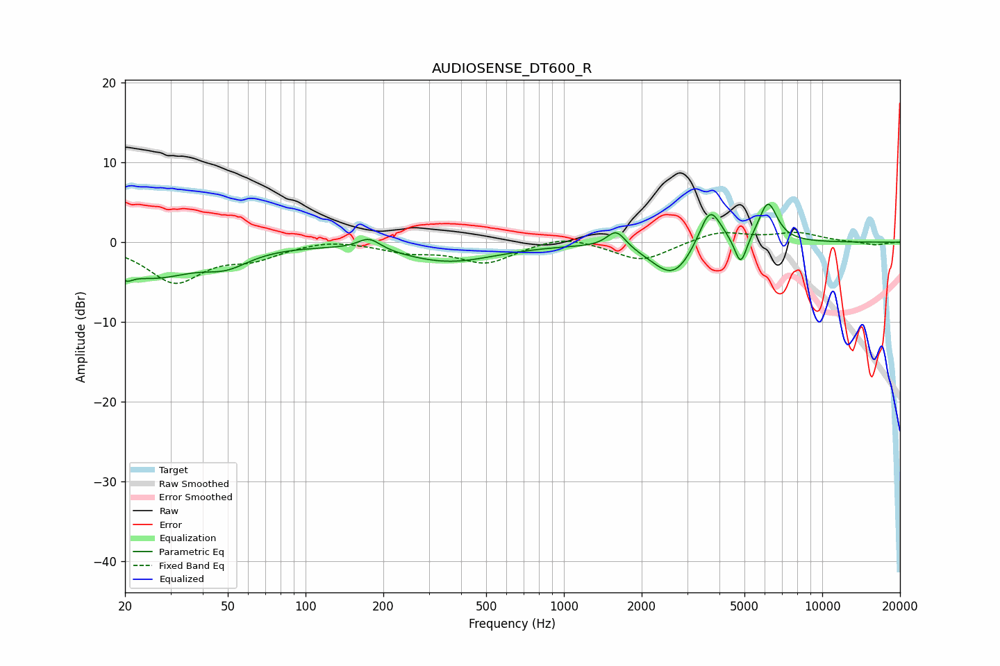

# AUDIOSENSE_DT600_R
See [usage instructions](https://github.com/jaakkopasanen/AutoEq#usage) for more options and info.

### Parametric EQs
Apply preamp of -4.8 dB when using parametric equalizer.

|   # | Type    |   Fc (Hz) |    Q |   Gain (dB) |
|-----|---------|-----------|------|-------------|
|   1 | Peaking |        20 | 5.44 |        -1.2 |
|   2 | Peaking |        25 | 0.86 |        -4.1 |
|   3 | Peaking |        49 | 1.59 |        -1.8 |
|   4 | Peaking |       176 | 3.17 |         1.5 |
|   5 | Peaking |       359 | 0.77 |        -2.4 |
|   6 | Peaking |      1595 | 3.85 |         2.3 |
|   7 | Peaking |      2651 | 1.71 |        -4.5 |
|   8 | Peaking |      3676 | 3.12 |         5.4 |
|   9 | Peaking |      4835 | 5.96 |        -3.7 |
|  10 | Peaking |      6166 | 3.8  |         5.1 |

### Fixed Band EQs
When using fixed band (also called graphic) equalizer, apply preamp of **-1.3 dB** (if available) and set gains manually with these parameters.

|   # | Type    |   Fc (Hz) |    Q |   Gain (dB) |
|-----|---------|-----------|------|-------------|
|   1 | Peaking |        31 | 1.41 |        -4.9 |
|   2 | Peaking |        62 | 1.41 |        -1.7 |
|   3 | Peaking |       125 | 1.41 |         0.5 |
|   4 | Peaking |       250 | 1.41 |        -1.1 |
|   5 | Peaking |       500 | 1.41 |        -2.5 |
|   6 | Peaking |      1000 | 1.41 |         1   |
|   7 | Peaking |      2000 | 1.41 |        -2.4 |
|   8 | Peaking |      4000 | 1.41 |         1.4 |
|   9 | Peaking |      8000 | 1.41 |         1.1 |
|  10 | Peaking |     16000 | 1.41 |        -0.4 |

### Graphs

