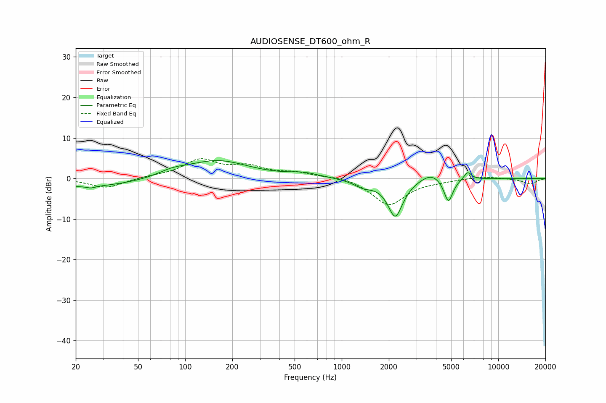

# AUDIOSENSE_DT600_ohm_R
See [usage instructions](https://github.com/jaakkopasanen/AutoEq#usage) for more options and info.

### Parametric EQs
Apply preamp of -4.5 dB when using parametric equalizer.

|   # | Type    |   Fc (Hz) |    Q |   Gain (dB) |
|-----|---------|-----------|------|-------------|
|   1 | Peaking |        24 | 0.41 |        -2.1 |
|   2 | Peaking |        25 | 5.39 |        -0.5 |
|   3 | Peaking |        83 | 1.59 |         1.2 |
|   4 | Peaking |       160 | 0.7  |         4.4 |
|   5 | Peaking |       573 | 1.51 |         1   |
|   6 | Peaking |      1375 | 2.26 |        -1.7 |
|   7 | Peaking |      2199 | 2.86 |        -9.3 |
|   8 | Peaking |      3726 | 2.06 |         2   |
|   9 | Peaking |      4803 | 4.81 |        -6   |
|  10 | Peaking |      6380 | 5.84 |         1.9 |

### Fixed Band EQs
When using fixed band (also called graphic) equalizer, apply preamp of **-5.0 dB** (if available) and set gains manually with these parameters.

|   # | Type    |   Fc (Hz) |    Q |   Gain (dB) |
|-----|---------|-----------|------|-------------|
|   1 | Peaking |        31 | 1.41 |        -2.4 |
|   2 | Peaking |        62 | 1.41 |         0.4 |
|   3 | Peaking |       125 | 1.41 |         4.4 |
|   4 | Peaking |       250 | 1.41 |         2.6 |
|   5 | Peaking |       500 | 1.41 |         1.3 |
|   6 | Peaking |      1000 | 1.41 |         0.7 |
|   7 | Peaking |      2000 | 1.41 |        -6.6 |
|   8 | Peaking |      4000 | 1.41 |        -0.4 |
|   9 | Peaking |      8000 | 1.41 |         0.6 |
|  10 | Peaking |     16000 | 1.41 |        -1.4 |

### Graphs

