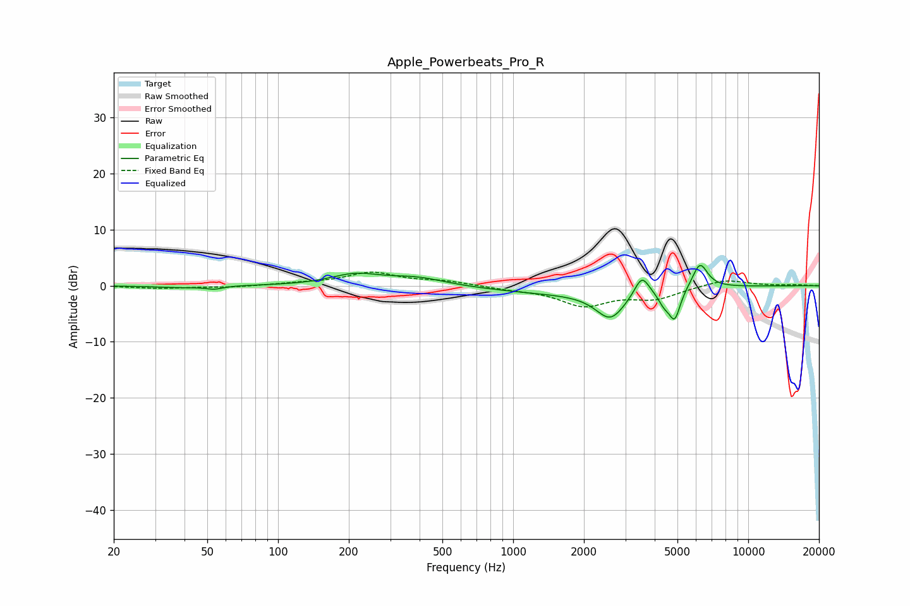

# Apple_Powerbeats_Pro_R
See [usage instructions](https://github.com/jaakkopasanen/AutoEq#usage) for more options and info.

### Parametric EQs
Apply preamp of -3.7 dB when using parametric equalizer.

|   # | Type    |   Fc (Hz) |    Q |   Gain (dB) |
|-----|---------|-----------|------|-------------|
|   1 | Peaking |        39 | 1.32 |        -0.3 |
|   2 | Peaking |        54 | 4.24 |        -0.5 |
|   3 | Peaking |       213 | 1.39 |         1.9 |
|   4 | Peaking |       387 | 1.14 |         1.5 |
|   5 | Peaking |      1580 | 0.47 |        -1.3 |
|   6 | Peaking |      2593 | 2.26 |        -4.9 |
|   7 | Peaking |      3527 | 4.5  |         3.7 |
|   8 | Peaking |      4384 | 5.42 |        -2   |
|   9 | Peaking |      4867 | 5.71 |        -5.3 |
|  10 | Peaking |      6233 | 4.2  |         4.6 |

### Fixed Band EQs
When using fixed band (also called graphic) equalizer, apply preamp of **-2.5 dB** (if available) and set gains manually with these parameters.

|   # | Type    |   Fc (Hz) |    Q |   Gain (dB) |
|-----|---------|-----------|------|-------------|
|   1 | Peaking |        31 | 1.41 |        -0.4 |
|   2 | Peaking |        62 | 1.41 |        -0.3 |
|   3 | Peaking |       125 | 1.41 |         0.4 |
|   4 | Peaking |       250 | 1.41 |         2.3 |
|   5 | Peaking |       500 | 1.41 |         0.8 |
|   6 | Peaking |      1000 | 1.41 |        -0.5 |
|   7 | Peaking |      2000 | 1.41 |        -3.4 |
|   8 | Peaking |      4000 | 1.41 |        -2.1 |
|   9 | Peaking |      8000 | 1.41 |         1.2 |
|  10 | Peaking |     16000 | 1.41 |         0.2 |

### Graphs

