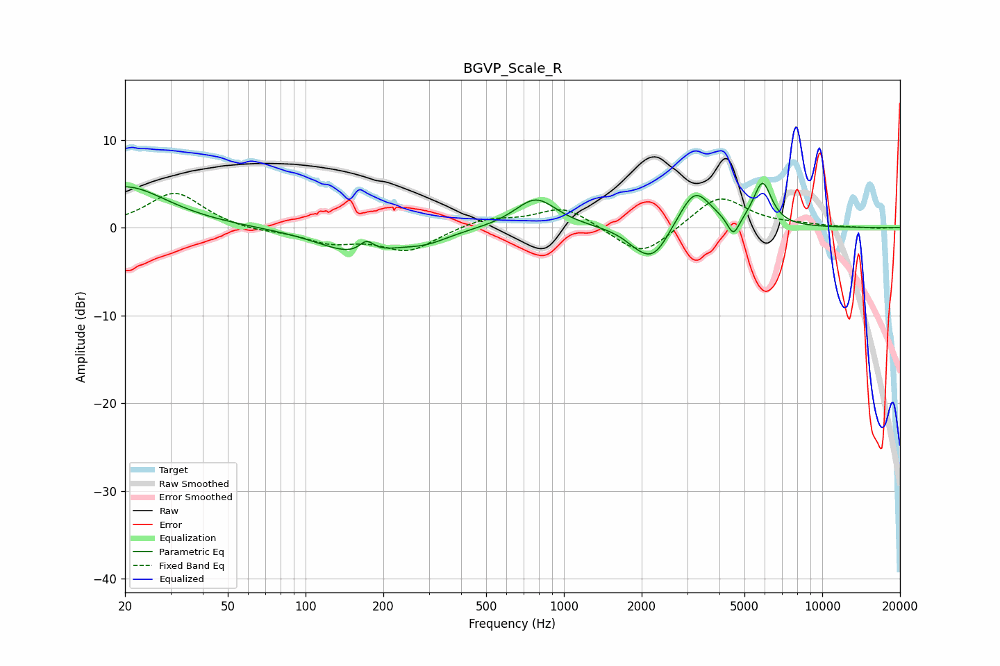

# BGVP_Scale_R
See [usage instructions](https://github.com/jaakkopasanen/AutoEq#usage) for more options and info.

### Parametric EQs
Apply preamp of -5.2 dB when using parametric equalizer.

|   # | Type    |   Fc (Hz) |    Q |   Gain (dB) |
|-----|---------|-----------|------|-------------|
|   1 | Peaking |        20 | 0.87 |         4.7 |
|   2 | Peaking |       160 | 0.96 |        -3   |
|   3 | Peaking |       172 | 4.94 |         1.4 |
|   4 | Peaking |       294 | 1.63 |        -1   |
|   5 | Peaking |       778 | 1.74 |         3.4 |
|   6 | Peaking |      1937 | 2.38 |        -1.1 |
|   7 | Peaking |      2236 | 2.26 |        -3.4 |
|   8 | Peaking |      3212 | 2.25 |         4.5 |
|   9 | Peaking |      4532 | 6    |        -2.3 |
|  10 | Peaking |      5873 | 3.93 |         4.9 |

### Fixed Band EQs
When using fixed band (also called graphic) equalizer, apply preamp of **-4.0 dB** (if available) and set gains manually with these parameters.

|   # | Type    |   Fc (Hz) |    Q |   Gain (dB) |
|-----|---------|-----------|------|-------------|
|   1 | Peaking |        31 | 1.41 |         4.1 |
|   2 | Peaking |        62 | 1.41 |        -0.4 |
|   3 | Peaking |       125 | 1.41 |        -1.6 |
|   4 | Peaking |       250 | 1.41 |        -2.6 |
|   5 | Peaking |       500 | 1.41 |         1.1 |
|   6 | Peaking |      1000 | 1.41 |         2.4 |
|   7 | Peaking |      2000 | 1.41 |        -3.5 |
|   8 | Peaking |      4000 | 1.41 |         3.7 |
|   9 | Peaking |      8000 | 1.41 |         0.2 |
|  10 | Peaking |     16000 | 1.41 |        -0.1 |

### Graphs

