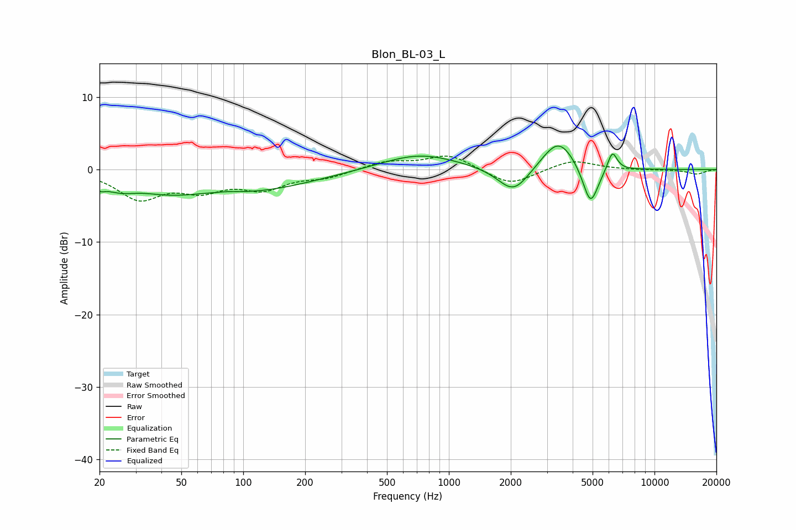

# Blon_BL-03_L
See [usage instructions](https://github.com/jaakkopasanen/AutoEq#usage) for more options and info.

### Parametric EQs
Apply preamp of -3.3 dB when using parametric equalizer.

|   # | Type    |   Fc (Hz) |    Q |   Gain (dB) |
|-----|---------|-----------|------|-------------|
|   1 | Peaking |        20 | 5.31 |        -1   |
|   2 | Peaking |        25 | 1.68 |        -1.6 |
|   3 | Peaking |        43 | 0.88 |        -2   |
|   4 | Peaking |        83 | 2.52 |         0.2 |
|   5 | Peaking |       114 | 0.49 |        -2.7 |
|   6 | Peaking |       718 | 0.76 |         2.2 |
|   7 | Peaking |      2064 | 1.85 |        -3.7 |
|   8 | Peaking |      3415 | 1.77 |         4.5 |
|   9 | Peaking |      4883 | 3.63 |        -5.6 |
|  10 | Peaking |      6237 | 5.88 |         2.7 |

### Fixed Band EQs
When using fixed band (also called graphic) equalizer, apply preamp of **-1.9 dB** (if available) and set gains manually with these parameters.

|   # | Type    |   Fc (Hz) |    Q |   Gain (dB) |
|-----|---------|-----------|------|-------------|
|   1 | Peaking |        31 | 1.41 |        -3.8 |
|   2 | Peaking |        62 | 1.41 |        -2.4 |
|   3 | Peaking |       125 | 1.41 |        -2.4 |
|   4 | Peaking |       250 | 1.41 |        -1   |
|   5 | Peaking |       500 | 1.41 |         1.1 |
|   6 | Peaking |      1000 | 1.41 |         2   |
|   7 | Peaking |      2000 | 1.41 |        -2.2 |
|   8 | Peaking |      4000 | 1.41 |         1.4 |
|   9 | Peaking |      8000 | 1.41 |        -0.1 |
|  10 | Peaking |     16000 | 1.41 |        -0.6 |

### Graphs

