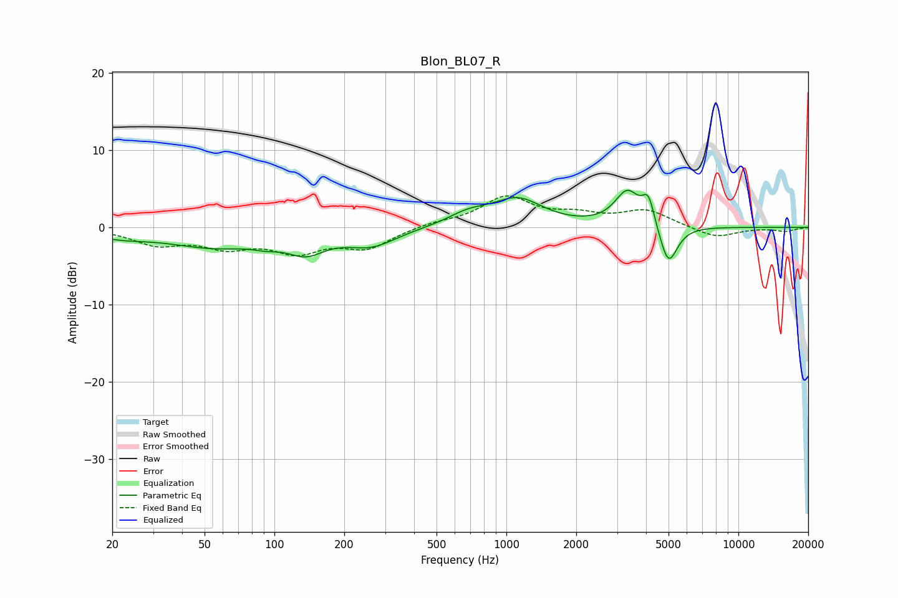

# Blon_BL07_R
See [usage instructions](https://github.com/jaakkopasanen/AutoEq#usage) for more options and info.

### Parametric EQs
Apply preamp of -4.9 dB when using parametric equalizer.

|   # | Type    |   Fc (Hz) |    Q |   Gain (dB) |
|-----|---------|-----------|------|-------------|
|   1 | Peaking |        22 | 1.08 |        -0.9 |
|   2 | Peaking |        55 | 0.72 |        -2.3 |
|   3 | Peaking |        92 | 2.46 |        -0.6 |
|   4 | Peaking |       137 | 1.72 |        -2.5 |
|   5 | Peaking |       262 | 1.29 |        -2.2 |
|   6 | Peaking |       684 | 1.57 |         1.4 |
|   7 | Peaking |      1119 | 1.29 |         3.5 |
|   8 | Peaking |      3323 | 2.61 |         4.5 |
|   9 | Peaking |      4098 | 5.36 |         3.5 |
|  10 | Peaking |      4994 | 3.6  |        -5.4 |

### Fixed Band EQs
When using fixed band (also called graphic) equalizer, apply preamp of **-4.2 dB** (if available) and set gains manually with these parameters.

|   # | Type    |   Fc (Hz) |    Q |   Gain (dB) |
|-----|---------|-----------|------|-------------|
|   1 | Peaking |        31 | 1.41 |        -2   |
|   2 | Peaking |        62 | 1.41 |        -2.2 |
|   3 | Peaking |       125 | 1.41 |        -2.8 |
|   4 | Peaking |       250 | 1.41 |        -2.5 |
|   5 | Peaking |       500 | 1.41 |         0.5 |
|   6 | Peaking |      1000 | 1.41 |         3.8 |
|   7 | Peaking |      2000 | 1.41 |         1.3 |
|   8 | Peaking |      4000 | 1.41 |         2.1 |
|   9 | Peaking |      8000 | 1.41 |        -1.4 |
|  10 | Peaking |     16000 | 1.41 |        -0.5 |

### Graphs

