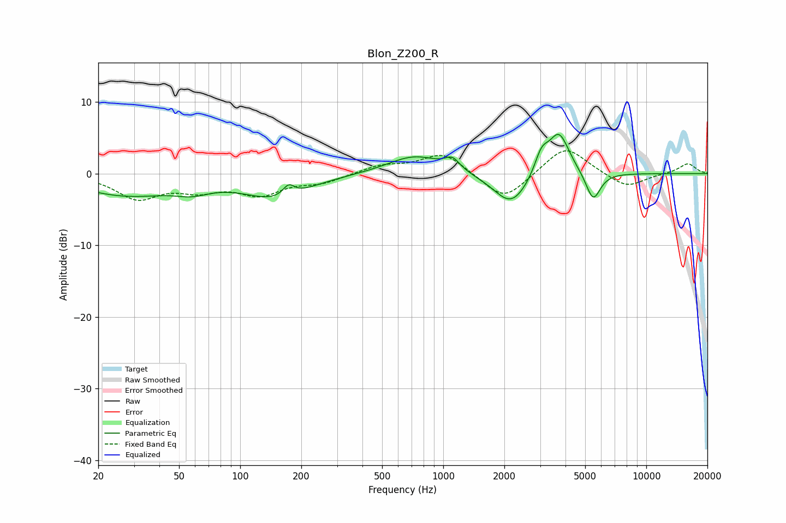

# Blon_Z200_R
See [usage instructions](https://github.com/jaakkopasanen/AutoEq#usage) for more options and info.

### Parametric EQs
Apply preamp of -5.6 dB when using parametric equalizer.

|   # | Type    |   Fc (Hz) |    Q |   Gain (dB) |
|-----|---------|-----------|------|-------------|
|   1 | Peaking |        27 | 0.59 |        -2.9 |
|   2 | Peaking |        58 | 1.72 |        -1.1 |
|   3 | Peaking |       150 | 0.89 |        -3.2 |
|   4 | Peaking |       173 | 4.97 |         1.5 |
|   5 | Peaking |       725 | 1.06 |         2.6 |
|   6 | Peaking |      1109 | 3.85 |         1.6 |
|   7 | Peaking |      2164 | 1.62 |        -4.7 |
|   8 | Peaking |      3049 | 4.03 |         3   |
|   9 | Peaking |      3715 | 2.7  |         5.9 |
|  10 | Peaking |      5474 | 3.88 |        -4   |

### Fixed Band EQs
When using fixed band (also called graphic) equalizer, apply preamp of **-3.3 dB** (if available) and set gains manually with these parameters.

|   # | Type    |   Fc (Hz) |    Q |   Gain (dB) |
|-----|---------|-----------|------|-------------|
|   1 | Peaking |        31 | 1.41 |        -3.3 |
|   2 | Peaking |        62 | 1.41 |        -1.9 |
|   3 | Peaking |       125 | 1.41 |        -2.7 |
|   4 | Peaking |       250 | 1.41 |        -1.1 |
|   5 | Peaking |       500 | 1.41 |         1.1 |
|   6 | Peaking |      1000 | 1.41 |         2.9 |
|   7 | Peaking |      2000 | 1.41 |        -4   |
|   8 | Peaking |      4000 | 1.41 |         4   |
|   9 | Peaking |      8000 | 1.41 |        -2.1 |
|  10 | Peaking |     16000 | 1.41 |         1.4 |

### Graphs

