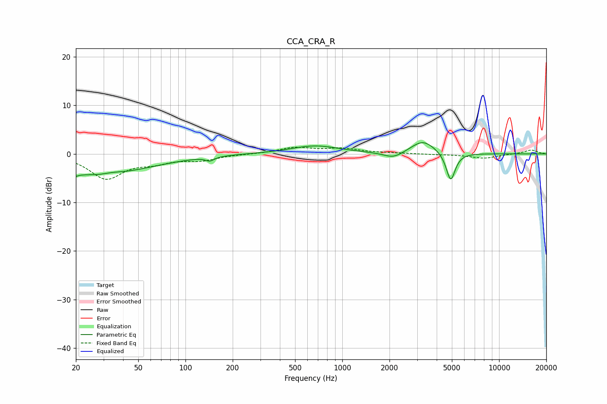

# CCA_CRA_R
See [usage instructions](https://github.com/jaakkopasanen/AutoEq#usage) for more options and info.

### Parametric EQs
Apply preamp of -2.4 dB when using parametric equalizer.

|   # | Type    |   Fc (Hz) |    Q |   Gain (dB) |
|-----|---------|-----------|------|-------------|
|   1 | Peaking |        20 | 5.8  |        -4.1 |
|   2 | Peaking |        20 | 5.97 |         3.2 |
|   3 | Peaking |        26 | 0.59 |        -3.8 |
|   4 | Peaking |        34 | 2.09 |         0.5 |
|   5 | Peaking |        53 | 0.56 |        -1.1 |
|   6 | Peaking |       143 | 5.24 |        -0.8 |
|   7 | Peaking |       670 | 0.92 |         1.7 |
|   8 | Peaking |      2122 | 2.23 |        -1.3 |
|   9 | Peaking |      3272 | 1.83 |         2.8 |
|  10 | Peaking |      4913 | 4.86 |        -5.9 |

### Fixed Band EQs
When using fixed band (also called graphic) equalizer, apply preamp of **-1.5 dB** (if available) and set gains manually with these parameters.

|   # | Type    |   Fc (Hz) |    Q |   Gain (dB) |
|-----|---------|-----------|------|-------------|
|   1 | Peaking |        31 | 1.41 |        -4.9 |
|   2 | Peaking |        62 | 1.41 |        -1.4 |
|   3 | Peaking |       125 | 1.41 |        -1.2 |
|   4 | Peaking |       250 | 1.41 |        -0   |
|   5 | Peaking |       500 | 1.41 |         1.2 |
|   6 | Peaking |      1000 | 1.41 |         1   |
|   7 | Peaking |      2000 | 1.41 |         0.1 |
|   8 | Peaking |      4000 | 1.41 |        -0.1 |
|   9 | Peaking |      8000 | 1.41 |        -0.9 |
|  10 | Peaking |     16000 | 1.41 |         0.8 |

### Graphs

