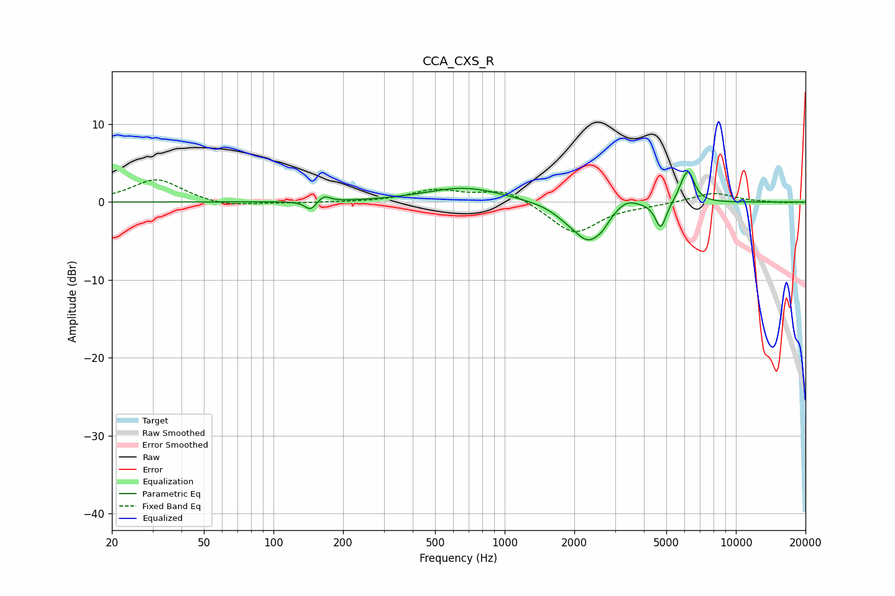

# CCA_CXS_R
See [usage instructions](https://github.com/jaakkopasanen/AutoEq#usage) for more options and info.

### Parametric EQs
Apply preamp of -4.0 dB when using parametric equalizer.

|   # | Type    |   Fc (Hz) |    Q |   Gain (dB) |
|-----|---------|-----------|------|-------------|
|   1 | Peaking |       145 | 5.99 |        -1.2 |
|   2 | Peaking |       166 | 6    |         0.8 |
|   3 | Peaking |       669 | 0.84 |         1.9 |
|   4 | Peaking |      1859 | 2.26 |        -0.8 |
|   5 | Peaking |      2318 | 2.11 |        -4.7 |
|   6 | Peaking |      2655 | 5.68 |        -0.6 |
|   7 | Peaking |      3350 | 2.8  |         1.2 |
|   8 | Peaking |      4733 | 6    |        -3.4 |
|   9 | Peaking |      5872 | 5.98 |         1.1 |
|  10 | Peaking |      6251 | 5.29 |         3.6 |

### Fixed Band EQs
When using fixed band (also called graphic) equalizer, apply preamp of **-3.0 dB** (if available) and set gains manually with these parameters.

|   # | Type    |   Fc (Hz) |    Q |   Gain (dB) |
|-----|---------|-----------|------|-------------|
|   1 | Peaking |        31 | 1.41 |         3   |
|   2 | Peaking |        62 | 1.41 |        -0.7 |
|   3 | Peaking |       125 | 1.41 |        -0.1 |
|   4 | Peaking |       250 | 1.41 |        -0   |
|   5 | Peaking |       500 | 1.41 |         1.5 |
|   6 | Peaking |      1000 | 1.41 |         1.7 |
|   7 | Peaking |      2000 | 1.41 |        -4.1 |
|   8 | Peaking |      4000 | 1.41 |        -0.3 |
|   9 | Peaking |      8000 | 1.41 |         1.2 |
|  10 | Peaking |     16000 | 1.41 |        -0.1 |

### Graphs

