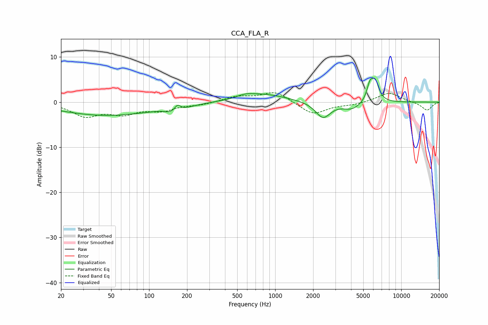

# CCA_FLA_R
See [usage instructions](https://github.com/jaakkopasanen/AutoEq#usage) for more options and info.

### Parametric EQs
Apply preamp of -5.4 dB when using parametric equalizer.

|   # | Type    |   Fc (Hz) |    Q |   Gain (dB) |
|-----|---------|-----------|------|-------------|
|   1 | Peaking |        45 | 0.39 |        -2.9 |
|   2 | Peaking |       123 | 2.54 |         0.4 |
|   3 | Peaking |       152 | 1.53 |        -1.5 |
|   4 | Peaking |       168 | 5.9  |         1.4 |
|   5 | Peaking |       580 | 2.07 |         0.7 |
|   6 | Peaking |       820 | 0.78 |         1.7 |
|   7 | Peaking |      2394 | 2.4  |        -3.5 |
|   8 | Peaking |      4062 | 1.96 |        -1.6 |
|   9 | Peaking |      5639 | 5.62 |         3.3 |
|  10 | Peaking |      6216 | 4.56 |         4.2 |

### Fixed Band EQs
When using fixed band (also called graphic) equalizer, apply preamp of **-2.2 dB** (if available) and set gains manually with these parameters.

|   # | Type    |   Fc (Hz) |    Q |   Gain (dB) |
|-----|---------|-----------|------|-------------|
|   1 | Peaking |        31 | 1.41 |        -2.9 |
|   2 | Peaking |        62 | 1.41 |        -2.2 |
|   3 | Peaking |       125 | 1.41 |        -1.6 |
|   4 | Peaking |       250 | 1.41 |        -0.5 |
|   5 | Peaking |       500 | 1.41 |         1.2 |
|   6 | Peaking |      1000 | 1.41 |         2.4 |
|   7 | Peaking |      2000 | 1.41 |        -2.8 |
|   8 | Peaking |      4000 | 1.41 |        -0.5 |
|   9 | Peaking |      8000 | 1.41 |         2.1 |
|  10 | Peaking |     16000 | 1.41 |        -1.8 |

### Graphs

