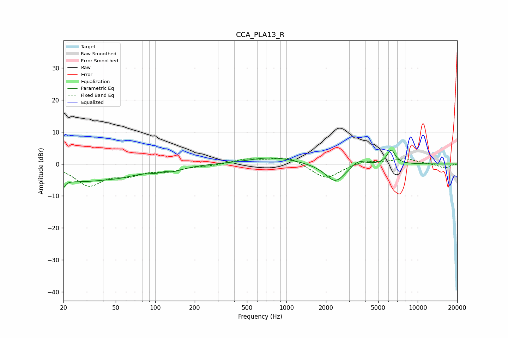

# CCA_PLA13_R
See [usage instructions](https://github.com/jaakkopasanen/AutoEq#usage) for more options and info.

### Parametric EQs
Apply preamp of -4.4 dB when using parametric equalizer.

|   # | Type    |   Fc (Hz) |    Q |   Gain (dB) |
|-----|---------|-----------|------|-------------|
|   1 | Peaking |        20 | 5.77 |        -5.8 |
|   2 | Peaking |        20 | 5.69 |         3.4 |
|   3 | Peaking |        27 | 0.47 |        -5.2 |
|   4 | Peaking |        55 | 1.41 |        -0.8 |
|   5 | Peaking |       118 | 3.86 |         1.1 |
|   6 | Peaking |       121 | 1.49 |        -2.3 |
|   7 | Peaking |       784 | 0.79 |         2.1 |
|   8 | Peaking |      2359 | 1.86 |        -5.9 |
|   9 | Peaking |      3521 | 2.71 |         2   |
|  10 | Peaking |      6275 | 4.36 |         4.4 |

### Fixed Band EQs
When using fixed band (also called graphic) equalizer, apply preamp of **-2.0 dB** (if available) and set gains manually with these parameters.

|   # | Type    |   Fc (Hz) |    Q |   Gain (dB) |
|-----|---------|-----------|------|-------------|
|   1 | Peaking |        31 | 1.41 |        -6.4 |
|   2 | Peaking |        62 | 1.41 |        -2.7 |
|   3 | Peaking |       125 | 1.41 |        -1.8 |
|   4 | Peaking |       250 | 1.41 |        -0.5 |
|   5 | Peaking |       500 | 1.41 |         1.5 |
|   6 | Peaking |      1000 | 1.41 |         2.4 |
|   7 | Peaking |      2000 | 1.41 |        -4.8 |
|   8 | Peaking |      4000 | 1.41 |         1.2 |
|   9 | Peaking |      8000 | 1.41 |         1.6 |
|  10 | Peaking |     16000 | 1.41 |        -1.3 |

### Graphs

