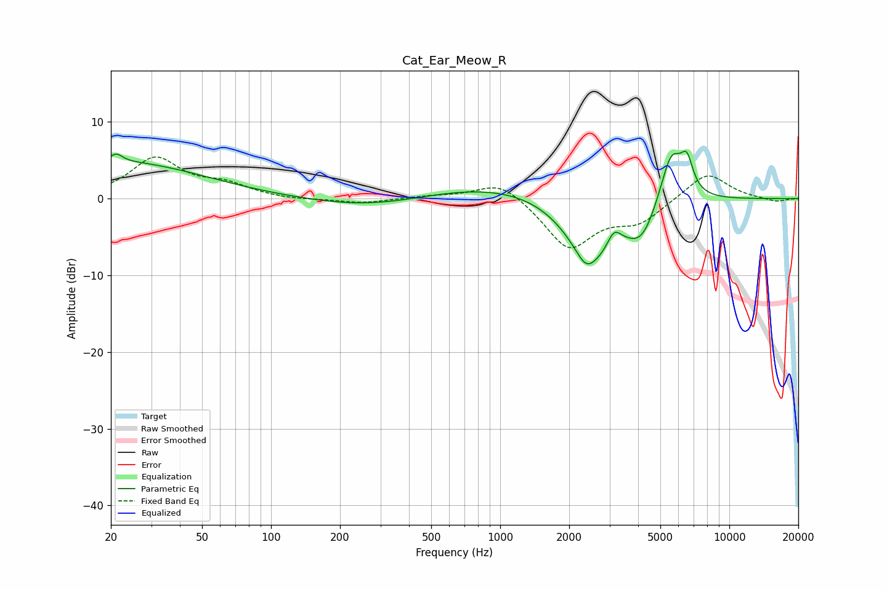

# Cat_Ear_Meow_R
See [usage instructions](https://github.com/jaakkopasanen/AutoEq#usage) for more options and info.

### Parametric EQs
Apply preamp of -6.3 dB when using parametric equalizer.

|   # | Type    |   Fc (Hz) |    Q |   Gain (dB) |
|-----|---------|-----------|------|-------------|
|   1 | Peaking |        21 | 5.38 |         1.1 |
|   2 | Peaking |        22 | 0.39 |         4.7 |
|   3 | Peaking |       278 | 0.56 |        -1.4 |
|   4 | Peaking |      1095 | 0.38 |         2.2 |
|   5 | Peaking |      2360 | 4.07 |        -1.2 |
|   6 | Peaking |      2483 | 1.23 |        -8.8 |
|   7 | Peaking |      3142 | 4.85 |         2   |
|   8 | Peaking |      4155 | 2.06 |        -4.4 |
|   9 | Peaking |      5584 | 2.69 |         7.2 |
|  10 | Peaking |      6532 | 5.17 |         3.7 |

### Fixed Band EQs
When using fixed band (also called graphic) equalizer, apply preamp of **-5.5 dB** (if available) and set gains manually with these parameters.

|   # | Type    |   Fc (Hz) |    Q |   Gain (dB) |
|-----|---------|-----------|------|-------------|
|   1 | Peaking |        31 | 1.41 |         5.1 |
|   2 | Peaking |        62 | 1.41 |         1.6 |
|   3 | Peaking |       125 | 1.41 |        -0.2 |
|   4 | Peaking |       250 | 1.41 |        -0.6 |
|   5 | Peaking |       500 | 1.41 |         0.3 |
|   6 | Peaking |      1000 | 1.41 |         2.5 |
|   7 | Peaking |      2000 | 1.41 |        -6.5 |
|   8 | Peaking |      4000 | 1.41 |        -2.8 |
|   9 | Peaking |      8000 | 1.41 |         3.5 |
|  10 | Peaking |     16000 | 1.41 |        -0.5 |

### Graphs

