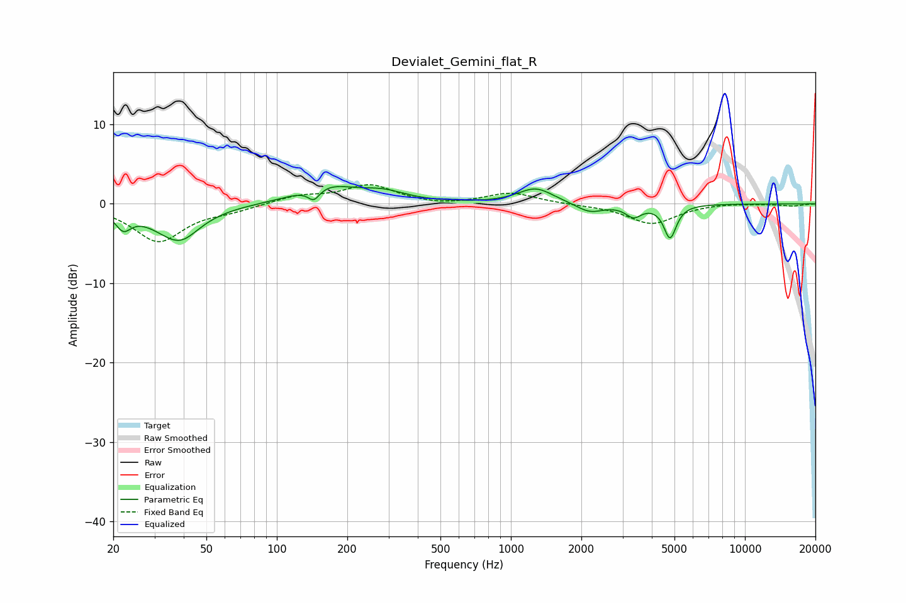

# Devialet_Gemini_flat_R
See [usage instructions](https://github.com/jaakkopasanen/AutoEq#usage) for more options and info.

### Parametric EQs
Apply preamp of -2.3 dB when using parametric equalizer.

|   # | Type    |   Fc (Hz) |    Q |   Gain (dB) |
|-----|---------|-----------|------|-------------|
|   1 | Peaking |        22 | 4.32 |        -2.2 |
|   2 | Peaking |        37 | 1.27 |        -3.3 |
|   3 | Peaking |        39 | 2.21 |        -1.3 |
|   4 | Peaking |       144 | 5.37 |        -1.6 |
|   5 | Peaking |       162 | 1.15 |         2.2 |
|   6 | Peaking |       286 | 1.47 |         1.2 |
|   7 | Peaking |      1276 | 1.87 |         2   |
|   8 | Peaking |      2173 | 2.45 |        -1.2 |
|   9 | Peaking |      3344 | 4.2  |        -1.5 |
|  10 | Peaking |      4787 | 5.35 |        -4.2 |

### Fixed Band EQs
When using fixed band (also called graphic) equalizer, apply preamp of **-2.5 dB** (if available) and set gains manually with these parameters.

|   # | Type    |   Fc (Hz) |    Q |   Gain (dB) |
|-----|---------|-----------|------|-------------|
|   1 | Peaking |        31 | 1.41 |        -4.7 |
|   2 | Peaking |        62 | 1.41 |        -0.7 |
|   3 | Peaking |       125 | 1.41 |         1   |
|   4 | Peaking |       250 | 1.41 |         2.3 |
|   5 | Peaking |       500 | 1.41 |        -0.3 |
|   6 | Peaking |      1000 | 1.41 |         1.4 |
|   7 | Peaking |      2000 | 1.41 |        -0.1 |
|   8 | Peaking |      4000 | 1.41 |        -2.5 |
|   9 | Peaking |      8000 | 1.41 |         0.1 |
|  10 | Peaking |     16000 | 1.41 |        -0.3 |

### Graphs

