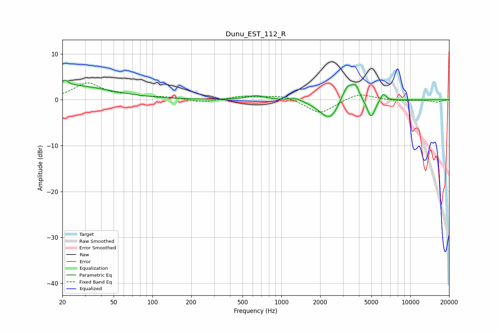

# Dunu_EST_112_R
See [usage instructions](https://github.com/jaakkopasanen/AutoEq#usage) for more options and info.

### Parametric EQs
Apply preamp of -4.3 dB when using parametric equalizer.

|   # | Type    |   Fc (Hz) |    Q |   Gain (dB) |
|-----|---------|-----------|------|-------------|
|   1 | Peaking |        21 | 5.82 |         1.2 |
|   2 | Peaking |        23 | 0.46 |         3.1 |
|   3 | Peaking |       640 | 2.04 |         0.9 |
|   4 | Peaking |      1292 | 2.98 |         0.7 |
|   5 | Peaking |      2378 | 1.74 |        -3.8 |
|   6 | Peaking |      2408 | 2.14 |        -1   |
|   7 | Peaking |      3281 | 2.64 |         4.6 |
|   8 | Peaking |      3802 | 5.99 |         2   |
|   9 | Peaking |      4961 | 4.53 |        -4.1 |
|  10 | Peaking |      6157 | 5.96 |         1.7 |

### Fixed Band EQs
When using fixed band (also called graphic) equalizer, apply preamp of **-3.8 dB** (if available) and set gains manually with these parameters.

|   # | Type    |   Fc (Hz) |    Q |   Gain (dB) |
|-----|---------|-----------|------|-------------|
|   1 | Peaking |        31 | 1.41 |         3.5 |
|   2 | Peaking |        62 | 1.41 |         0.7 |
|   3 | Peaking |       125 | 1.41 |         0.5 |
|   4 | Peaking |       250 | 1.41 |        -0.6 |
|   5 | Peaking |       500 | 1.41 |         0.7 |
|   6 | Peaking |      1000 | 1.41 |         1   |
|   7 | Peaking |      2000 | 1.41 |        -3.1 |
|   8 | Peaking |      4000 | 1.41 |         1.5 |
|   9 | Peaking |      8000 | 1.41 |        -0.2 |
|  10 | Peaking |     16000 | 1.41 |        -0.5 |

### Graphs

