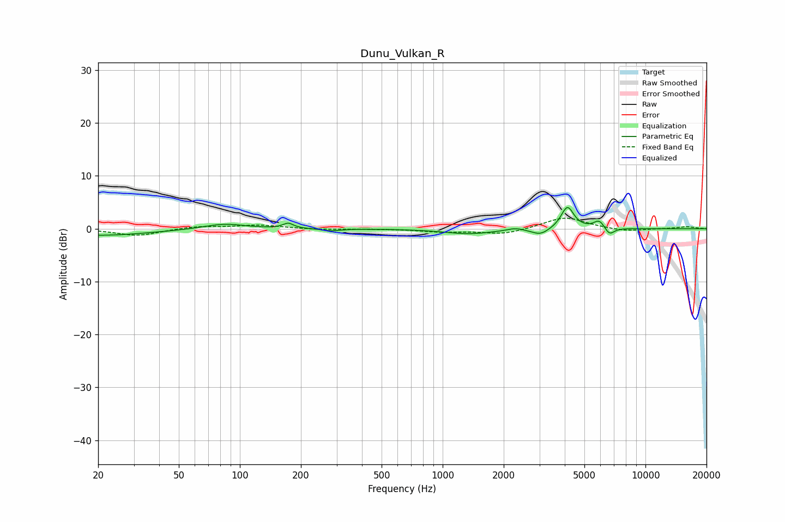

# Dunu_Vulkan_R
See [usage instructions](https://github.com/jaakkopasanen/AutoEq#usage) for more options and info.

### Parametric EQs
Apply preamp of -4.1 dB when using parametric equalizer.

|   # | Type    |   Fc (Hz) |    Q |   Gain (dB) |
|-----|---------|-----------|------|-------------|
|   1 | Peaking |        20 | 0.56 |        -1.3 |
|   2 | Peaking |        84 | 1.4  |         1   |
|   3 | Peaking |       173 | 5.66 |         1   |
|   4 | Peaking |       283 | 3.24 |        -0.4 |
|   5 | Peaking |      1346 | 1.13 |        -0.9 |
|   6 | Peaking |      2279 | 3.71 |         0.5 |
|   7 | Peaking |      3034 | 3.37 |        -1.2 |
|   8 | Peaking |      4123 | 4.53 |         4.2 |
|   9 | Peaking |      5912 | 5.25 |         1.6 |
|  10 | Peaking |      6648 | 5.86 |        -1.4 |

### Fixed Band EQs
When using fixed band (also called graphic) equalizer, apply preamp of **-2.1 dB** (if available) and set gains manually with these parameters.

|   # | Type    |   Fc (Hz) |    Q |   Gain (dB) |
|-----|---------|-----------|------|-------------|
|   1 | Peaking |        31 | 1.41 |        -1.3 |
|   2 | Peaking |        62 | 1.41 |         0.5 |
|   3 | Peaking |       125 | 1.41 |         0.7 |
|   4 | Peaking |       250 | 1.41 |        -0.2 |
|   5 | Peaking |       500 | 1.41 |        -0   |
|   6 | Peaking |      1000 | 1.41 |        -0.6 |
|   7 | Peaking |      2000 | 1.41 |        -1.1 |
|   8 | Peaking |      4000 | 1.41 |         2.3 |
|   9 | Peaking |      8000 | 1.41 |        -0.6 |
|  10 | Peaking |     16000 | 1.41 |         0.4 |

### Graphs

