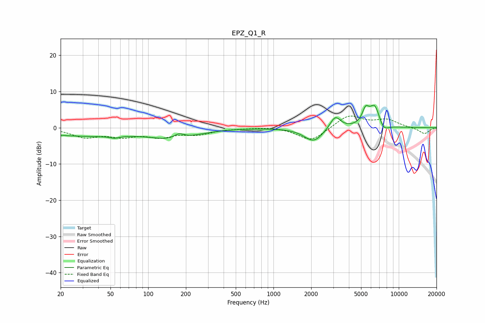

# EPZ_Q1_R
See [usage instructions](https://github.com/jaakkopasanen/AutoEq#usage) for more options and info.

### Parametric EQs
Apply preamp of -6.3 dB when using parametric equalizer.

|   # | Type    |   Fc (Hz) |    Q |   Gain (dB) |
|-----|---------|-----------|------|-------------|
|   1 | Peaking |        21 | 2.79 |        -0.1 |
|   2 | Peaking |        32 | 0.4  |        -2.2 |
|   3 | Peaking |        54 | 4.06 |        -0.6 |
|   4 | Peaking |       162 | 0.8  |        -2.8 |
|   5 | Peaking |       176 | 3.45 |         1.5 |
|   6 | Peaking |      2091 | 1.88 |        -3.9 |
|   7 | Peaking |      3109 | 3.36 |         3.6 |
|   8 | Peaking |      5434 | 5.09 |         3.8 |
|   9 | Peaking |      6432 | 3.13 |         6.2 |
|  10 | Peaking |      7534 | 3.36 |        -2.4 |

### Fixed Band EQs
When using fixed band (also called graphic) equalizer, apply preamp of **-3.3 dB** (if available) and set gains manually with these parameters.

|   # | Type    |   Fc (Hz) |    Q |   Gain (dB) |
|-----|---------|-----------|------|-------------|
|   1 | Peaking |        31 | 1.41 |        -2.4 |
|   2 | Peaking |        62 | 1.41 |        -2   |
|   3 | Peaking |       125 | 1.41 |        -2.2 |
|   4 | Peaking |       250 | 1.41 |        -1.6 |
|   5 | Peaking |       500 | 1.41 |        -0.1 |
|   6 | Peaking |      1000 | 1.41 |         0.3 |
|   7 | Peaking |      2000 | 1.41 |        -3.8 |
|   8 | Peaking |      4000 | 1.41 |         3.5 |
|   9 | Peaking |      8000 | 1.41 |         2.1 |
|  10 | Peaking |     16000 | 1.41 |        -1.7 |

### Graphs

