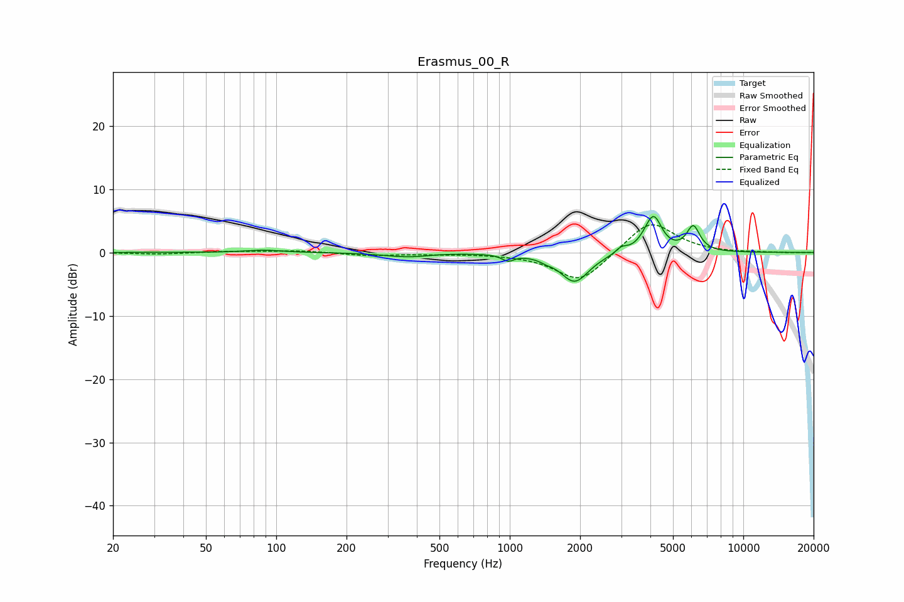

# Erasmus_00_R
See [usage instructions](https://github.com/jaakkopasanen/AutoEq#usage) for more options and info.

### Parametric EQs
Apply preamp of -5.8 dB when using parametric equalizer.

|   # | Type    |   Fc (Hz) |    Q |   Gain (dB) |
|-----|---------|-----------|------|-------------|
|   1 | Peaking |        88 | 1.86 |         0.4 |
|   2 | Peaking |       336 | 1.43 |        -0.4 |
|   3 | Peaking |       392 | 2.21 |        -0.2 |
|   4 | Peaking |       982 | 5.86 |        -1   |
|   5 | Peaking |      1429 | 5.96 |        -0.3 |
|   6 | Peaking |      1896 | 2.31 |        -4.7 |
|   7 | Peaking |      3006 | 5.92 |         0.9 |
|   8 | Peaking |      3931 | 3.69 |         1.5 |
|   9 | Peaking |      4155 | 4.16 |         4.4 |
|  10 | Peaking |      6107 | 4.94 |         3.9 |

### Fixed Band EQs
When using fixed band (also called graphic) equalizer, apply preamp of **-4.5 dB** (if available) and set gains manually with these parameters.

|   # | Type    |   Fc (Hz) |    Q |   Gain (dB) |
|-----|---------|-----------|------|-------------|
|   1 | Peaking |        31 | 1.41 |        -0.3 |
|   2 | Peaking |        62 | 1.41 |         0.2 |
|   3 | Peaking |       125 | 1.41 |         0.3 |
|   4 | Peaking |       250 | 1.41 |        -0.5 |
|   5 | Peaking |       500 | 1.41 |        -0.2 |
|   6 | Peaking |      1000 | 1.41 |        -0.1 |
|   7 | Peaking |      2000 | 1.41 |        -4.8 |
|   8 | Peaking |      4000 | 1.41 |         5.2 |
|   9 | Peaking |      8000 | 1.41 |        -0.1 |
|  10 | Peaking |     16000 | 1.41 |        -0.1 |

### Graphs

