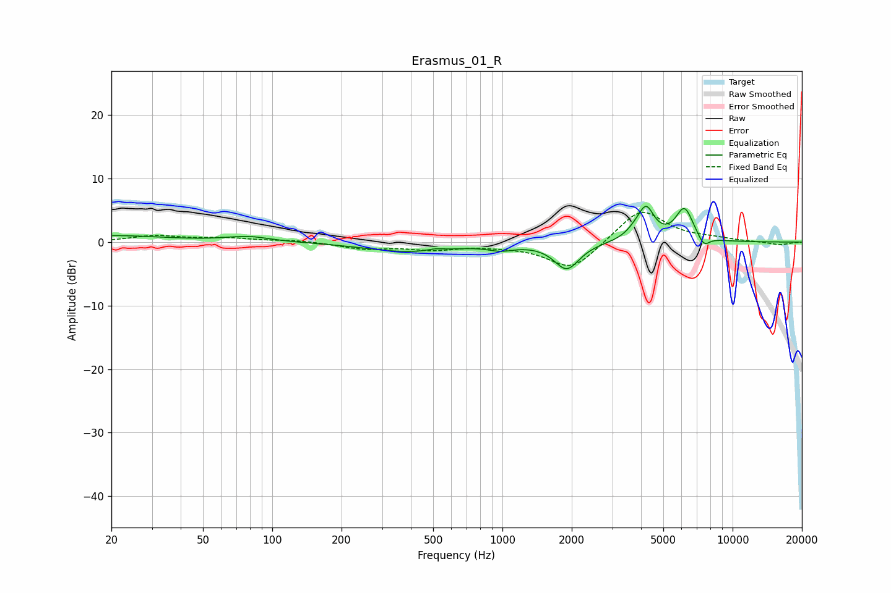

# Erasmus_01_R
See [usage instructions](https://github.com/jaakkopasanen/AutoEq#usage) for more options and info.

### Parametric EQs
Apply preamp of -5.7 dB when using parametric equalizer.

|   # | Type    |   Fc (Hz) |    Q |   Gain (dB) |
|-----|---------|-----------|------|-------------|
|   1 | Peaking |        20 | 0.6  |         1   |
|   2 | Peaking |        79 | 1.49 |         0.8 |
|   3 | Peaking |       389 | 0.77 |        -1.5 |
|   4 | Peaking |       511 | 4.6  |         0.3 |
|   5 | Peaking |       986 | 2.54 |        -0.8 |
|   6 | Peaking |      1903 | 2.61 |        -4.2 |
|   7 | Peaking |      3785 | 3.29 |         1   |
|   8 | Peaking |      4213 | 3.99 |         4.7 |
|   9 | Peaking |      6174 | 3.57 |         5.2 |
|  10 | Peaking |      7494 | 5.36 |        -1.7 |

### Fixed Band EQs
When using fixed band (also called graphic) equalizer, apply preamp of **-4.8 dB** (if available) and set gains manually with these parameters.

|   # | Type    |   Fc (Hz) |    Q |   Gain (dB) |
|-----|---------|-----------|------|-------------|
|   1 | Peaking |        31 | 1.41 |         1   |
|   2 | Peaking |        62 | 1.41 |         0.6 |
|   3 | Peaking |       125 | 1.41 |         0.3 |
|   4 | Peaking |       250 | 1.41 |        -1   |
|   5 | Peaking |       500 | 1.41 |        -1   |
|   6 | Peaking |      1000 | 1.41 |        -0.4 |
|   7 | Peaking |      2000 | 1.41 |        -4.5 |
|   8 | Peaking |      4000 | 1.41 |         5.4 |
|   9 | Peaking |      8000 | 1.41 |         0.4 |
|  10 | Peaking |     16000 | 1.41 |        -0.5 |

### Graphs

