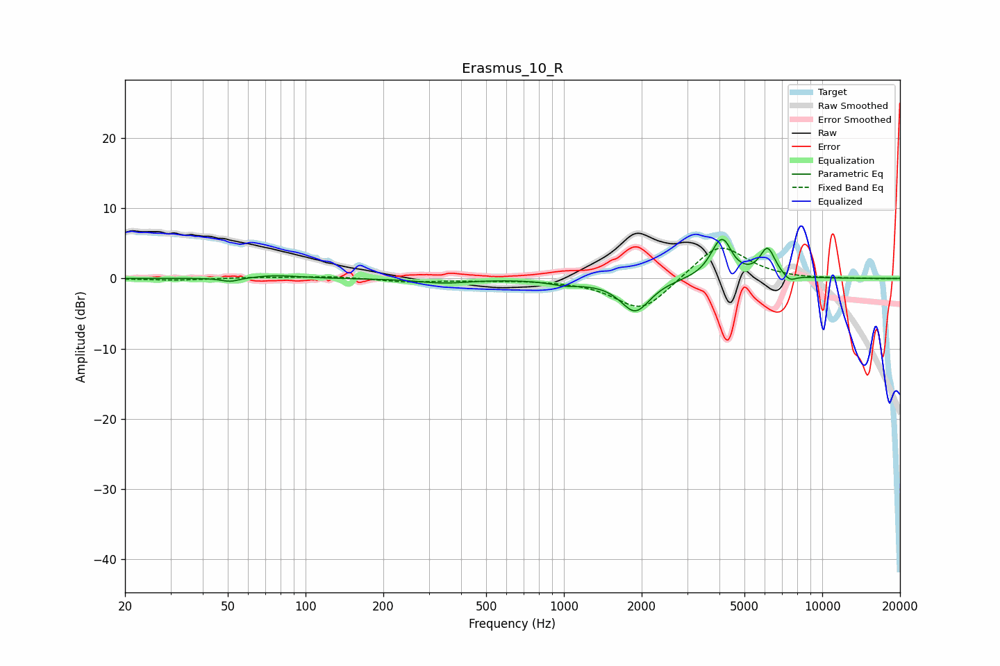

# Erasmus_10_R
See [usage instructions](https://github.com/jaakkopasanen/AutoEq#usage) for more options and info.

### Parametric EQs
Apply preamp of -5.7 dB when using parametric equalizer.

|   # | Type    |   Fc (Hz) |    Q |   Gain (dB) |
|-----|---------|-----------|------|-------------|
|   1 | Peaking |        51 | 4.09 |        -0.5 |
|   2 | Peaking |        77 | 1.65 |         0.4 |
|   3 | Peaking |       343 | 1.42 |        -0.6 |
|   4 | Peaking |      1054 | 2.16 |        -0.9 |
|   5 | Peaking |      1113 | 3.7  |         0.3 |
|   6 | Peaking |      1889 | 2.46 |        -4.7 |
|   7 | Peaking |      4027 | 3.5  |         4.9 |
|   8 | Peaking |      4239 | 5.99 |         0.9 |
|   9 | Peaking |      6142 | 4.6  |         4.1 |
|  10 | Peaking |      7469 | 5.39 |        -0.9 |

### Fixed Band EQs
When using fixed band (also called graphic) equalizer, apply preamp of **-4.4 dB** (if available) and set gains manually with these parameters.

|   # | Type    |   Fc (Hz) |    Q |   Gain (dB) |
|-----|---------|-----------|------|-------------|
|   1 | Peaking |        31 | 1.41 |        -0.3 |
|   2 | Peaking |        62 | 1.41 |         0.1 |
|   3 | Peaking |       125 | 1.41 |         0.3 |
|   4 | Peaking |       250 | 1.41 |        -0.5 |
|   5 | Peaking |       500 | 1.41 |        -0.2 |
|   6 | Peaking |      1000 | 1.41 |        -0.1 |
|   7 | Peaking |      2000 | 1.41 |        -4.8 |
|   8 | Peaking |      4000 | 1.41 |         5.2 |
|   9 | Peaking |      8000 | 1.41 |        -0.1 |
|  10 | Peaking |     16000 | 1.41 |        -0   |

### Graphs

