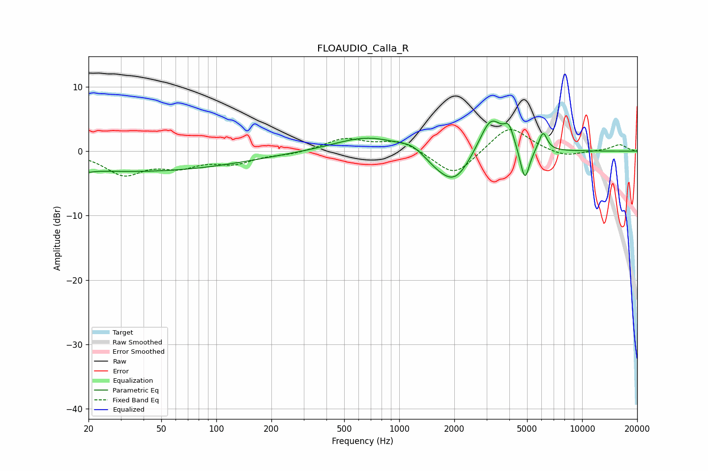

# FLOAUDIO_Calla_R
See [usage instructions](https://github.com/jaakkopasanen/AutoEq#usage) for more options and info.

### Parametric EQs
Apply preamp of -4.8 dB when using parametric equalizer.

|   # | Type    |   Fc (Hz) |    Q |   Gain (dB) |
|-----|---------|-----------|------|-------------|
|   1 | Peaking |        20 | 5.09 |        -0.3 |
|   2 | Peaking |        34 | 0.22 |        -3.1 |
|   3 | Peaking |       672 | 0.8  |         2.3 |
|   4 | Peaking |      1184 | 2.13 |         1   |
|   5 | Peaking |      1630 | 1.6  |        -1.5 |
|   6 | Peaking |      2029 | 1.62 |        -4.6 |
|   7 | Peaking |      3170 | 2.17 |         5.8 |
|   8 | Peaking |      3978 | 5.22 |         2.7 |
|   9 | Peaking |      4861 | 5.49 |        -5.4 |
|  10 | Peaking |      6112 | 6    |         3   |

### Fixed Band EQs
When using fixed band (also called graphic) equalizer, apply preamp of **-3.4 dB** (if available) and set gains manually with these parameters.

|   # | Type    |   Fc (Hz) |    Q |   Gain (dB) |
|-----|---------|-----------|------|-------------|
|   1 | Peaking |        31 | 1.41 |        -3.4 |
|   2 | Peaking |        62 | 1.41 |        -2   |
|   3 | Peaking |       125 | 1.41 |        -1.7 |
|   4 | Peaking |       250 | 1.41 |        -0.4 |
|   5 | Peaking |       500 | 1.41 |         1.9 |
|   6 | Peaking |      1000 | 1.41 |         1.7 |
|   7 | Peaking |      2000 | 1.41 |        -4.1 |
|   8 | Peaking |      4000 | 1.41 |         4.1 |
|   9 | Peaking |      8000 | 1.41 |        -1   |
|  10 | Peaking |     16000 | 1.41 |         1   |

### Graphs

