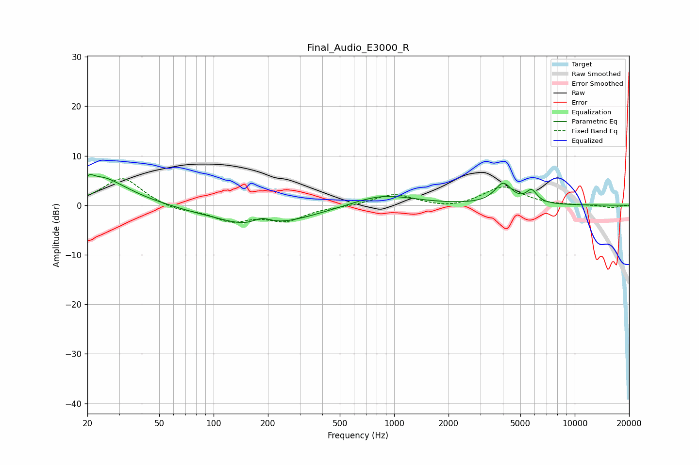

# Final_Audio_E3000_R
See [usage instructions](https://github.com/jaakkopasanen/AutoEq#usage) for more options and info.

### Parametric EQs
Apply preamp of -6.3 dB when using parametric equalizer.

|   # | Type    |   Fc (Hz) |    Q |   Gain (dB) |
|-----|---------|-----------|------|-------------|
|   1 | Peaking |        21 | 5.97 |         1.5 |
|   2 | Peaking |        24 | 2.11 |         0.9 |
|   3 | Peaking |        25 | 0.91 |         4.7 |
|   4 | Peaking |        78 | 1.2  |        -0.3 |
|   5 | Peaking |       144 | 1.28 |        -0.7 |
|   6 | Peaking |       185 | 2.82 |         1.4 |
|   7 | Peaking |       194 | 0.55 |        -3.9 |
|   8 | Peaking |       859 | 0.83 |         2.3 |
|   9 | Peaking |      4021 | 2.96 |         4.1 |
|  10 | Peaking |      5765 | 4.58 |         2.5 |

### Fixed Band EQs
When using fixed band (also called graphic) equalizer, apply preamp of **-5.5 dB** (if available) and set gains manually with these parameters.

|   # | Type    |   Fc (Hz) |    Q |   Gain (dB) |
|-----|---------|-----------|------|-------------|
|   1 | Peaking |        31 | 1.41 |         5.7 |
|   2 | Peaking |        62 | 1.41 |        -1.1 |
|   3 | Peaking |       125 | 1.41 |        -2.9 |
|   4 | Peaking |       250 | 1.41 |        -2.9 |
|   5 | Peaking |       500 | 1.41 |        -0.2 |
|   6 | Peaking |      1000 | 1.41 |         2.3 |
|   7 | Peaking |      2000 | 1.41 |        -0.7 |
|   8 | Peaking |      4000 | 1.41 |         3.8 |
|   9 | Peaking |      8000 | 1.41 |        -0.1 |
|  10 | Peaking |     16000 | 1.41 |        -0.5 |

### Graphs

