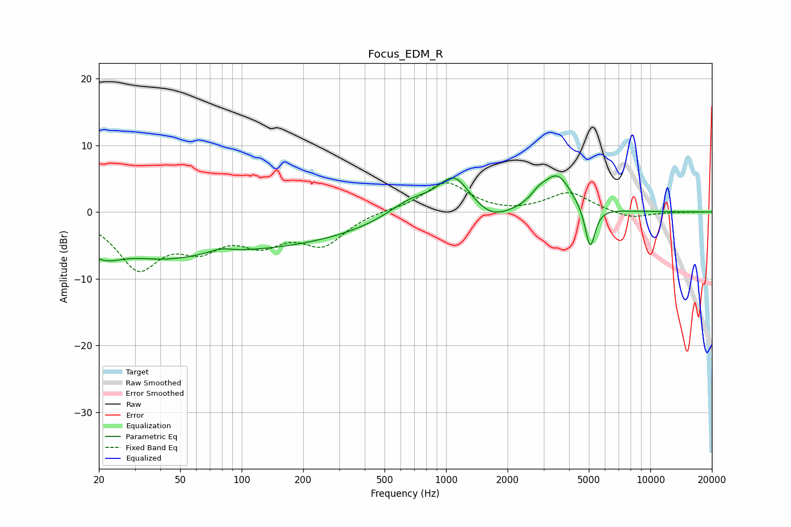

# Focus_EDM_R
See [usage instructions](https://github.com/jaakkopasanen/AutoEq#usage) for more options and info.

### Parametric EQs
Apply preamp of -5.5 dB when using parametric equalizer.

|   # | Type    |   Fc (Hz) |    Q |   Gain (dB) |
|-----|---------|-----------|------|-------------|
|   1 | Peaking |        21 | 1.47 |        -3.3 |
|   2 | Peaking |        41 | 0.84 |        -1.7 |
|   3 | Peaking |        79 | 2.64 |         0.7 |
|   4 | Peaking |        89 | 0.2  |        -5.5 |
|   5 | Peaking |       669 | 1.24 |         2.5 |
|   6 | Peaking |      1097 | 1.78 |         5.4 |
|   7 | Peaking |      1666 | 1.53 |        -2   |
|   8 | Peaking |      2851 | 3.59 |         1.2 |
|   9 | Peaking |      3508 | 2.01 |         5.4 |
|  10 | Peaking |      5072 | 5.69 |        -6.5 |

### Fixed Band EQs
When using fixed band (also called graphic) equalizer, apply preamp of **-4.4 dB** (if available) and set gains manually with these parameters.

|   # | Type    |   Fc (Hz) |    Q |   Gain (dB) |
|-----|---------|-----------|------|-------------|
|   1 | Peaking |        31 | 1.41 |        -8   |
|   2 | Peaking |        62 | 1.41 |        -4.3 |
|   3 | Peaking |       125 | 1.41 |        -3.9 |
|   4 | Peaking |       250 | 1.41 |        -4.5 |
|   5 | Peaking |       500 | 1.41 |         0.3 |
|   6 | Peaking |      1000 | 1.41 |         4.5 |
|   7 | Peaking |      2000 | 1.41 |        -0.3 |
|   8 | Peaking |      4000 | 1.41 |         2.9 |
|   9 | Peaking |      8000 | 1.41 |        -1.1 |
|  10 | Peaking |     16000 | 1.41 |        -0   |

### Graphs

