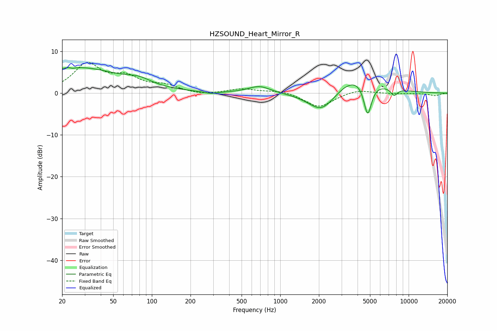

# HZSOUND_Heart_Mirror_R
See [usage instructions](https://github.com/jaakkopasanen/AutoEq#usage) for more options and info.

### Parametric EQs
Apply preamp of -6.2 dB when using parametric equalizer.

|   # | Type    |   Fc (Hz) |    Q |   Gain (dB) |
|-----|---------|-----------|------|-------------|
|   1 | Peaking |        23 | 5.54 |         1.8 |
|   2 | Peaking |        24 | 5.72 |        -1.8 |
|   3 | Peaking |        26 | 0.41 |         6.1 |
|   4 | Peaking |        80 | 1.57 |         1.3 |
|   5 | Peaking |       288 | 2.68 |        -0.5 |
|   6 | Peaking |       687 | 1.67 |         1.7 |
|   7 | Peaking |      2108 | 1.3  |        -5.4 |
|   8 | Peaking |      3951 | 0.83 |         4.9 |
|   9 | Peaking |      4796 | 4.41 |        -8.3 |
|  10 | Peaking |      7702 | 5.34 |        -1.7 |

### Fixed Band EQs
When using fixed band (also called graphic) equalizer, apply preamp of **-7.4 dB** (if available) and set gains manually with these parameters.

|   # | Type    |   Fc (Hz) |    Q |   Gain (dB) |
|-----|---------|-----------|------|-------------|
|   1 | Peaking |        31 | 1.41 |         6.7 |
|   2 | Peaking |        62 | 1.41 |         3.2 |
|   3 | Peaking |       125 | 1.41 |         1.6 |
|   4 | Peaking |       250 | 1.41 |        -0.5 |
|   5 | Peaking |       500 | 1.41 |         1   |
|   6 | Peaking |      1000 | 1.41 |         0.7 |
|   7 | Peaking |      2000 | 1.41 |        -3.4 |
|   8 | Peaking |      4000 | 1.41 |         0.9 |
|   9 | Peaking |      8000 | 1.41 |        -0.1 |
|  10 | Peaking |     16000 | 1.41 |        -0.6 |

### Graphs

