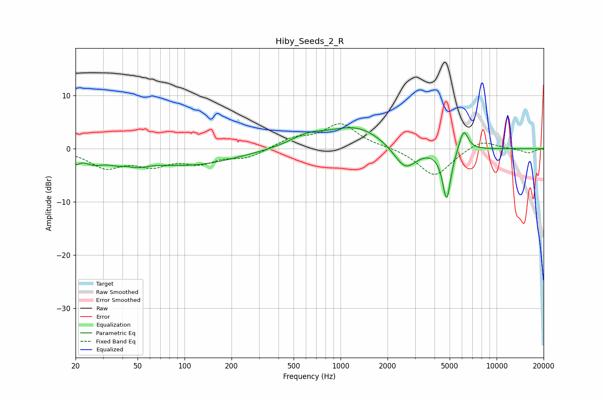

# Hiby_Seeds_2_R
See [usage instructions](https://github.com/jaakkopasanen/AutoEq#usage) for more options and info.

### Parametric EQs
Apply preamp of -4.0 dB when using parametric equalizer.

|   # | Type    |   Fc (Hz) |    Q |   Gain (dB) |
|-----|---------|-----------|------|-------------|
|   1 | Peaking |        20 | 5.52 |        -1.5 |
|   2 | Peaking |        26 | 2.15 |        -1.7 |
|   3 | Peaking |        43 | 2.78 |         1.5 |
|   4 | Peaking |        43 | 1.6  |        -3.2 |
|   5 | Peaking |       111 | 0.49 |        -2.9 |
|   6 | Peaking |       612 | 1.26 |         1.8 |
|   7 | Peaking |      1265 | 0.79 |         4.1 |
|   8 | Peaking |      2592 | 1.91 |        -4.6 |
|   9 | Peaking |      4783 | 5.2  |        -9.7 |
|  10 | Peaking |      6139 | 4.6  |         4.1 |

### Fixed Band EQs
When using fixed band (also called graphic) equalizer, apply preamp of **-4.8 dB** (if available) and set gains manually with these parameters.

|   # | Type    |   Fc (Hz) |    Q |   Gain (dB) |
|-----|---------|-----------|------|-------------|
|   1 | Peaking |        31 | 1.41 |        -3.3 |
|   2 | Peaking |        62 | 1.41 |        -2.7 |
|   3 | Peaking |       125 | 1.41 |        -2.3 |
|   4 | Peaking |       250 | 1.41 |        -1.6 |
|   5 | Peaking |       500 | 1.41 |         1.8 |
|   6 | Peaking |      1000 | 1.41 |         4.6 |
|   7 | Peaking |      2000 | 1.41 |         0.3 |
|   8 | Peaking |      4000 | 1.41 |        -5.3 |
|   9 | Peaking |      8000 | 1.41 |         1.8 |
|  10 | Peaking |     16000 | 1.41 |        -0.8 |

### Graphs

