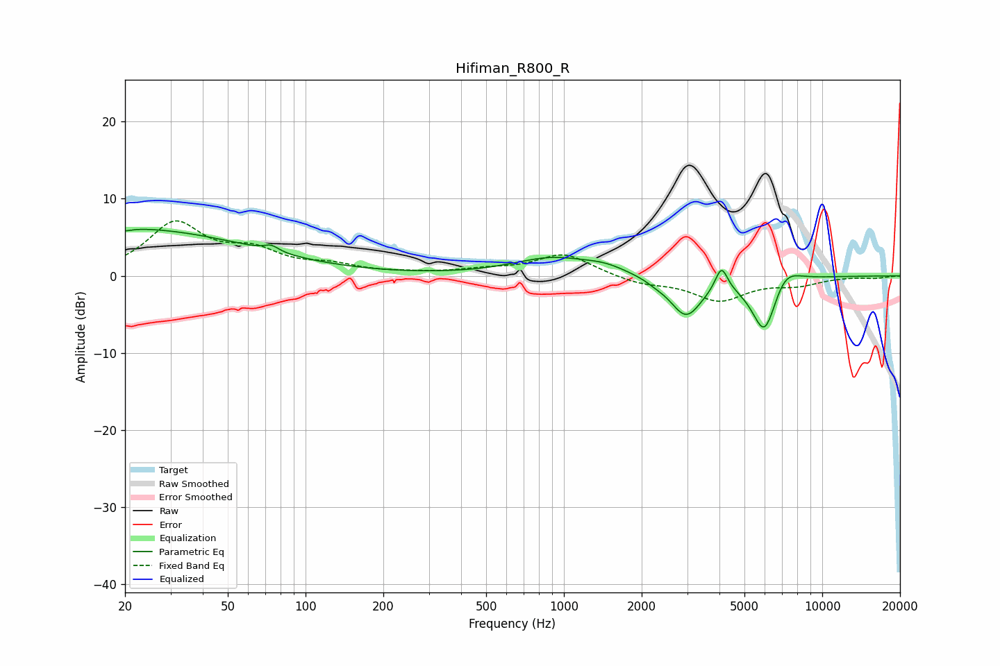

# Hifiman_R800_R
See [usage instructions](https://github.com/jaakkopasanen/AutoEq#usage) for more options and info.

### Parametric EQs
Apply preamp of -6.1 dB when using parametric equalizer.

|   # | Type    |   Fc (Hz) |    Q |   Gain (dB) |
|-----|---------|-----------|------|-------------|
|   1 | Peaking |        20 | 5.91 |        -0.3 |
|   2 | Peaking |        20 | 0.28 |         6.1 |
|   3 | Peaking |        74 | 5    |         0.8 |
|   4 | Peaking |       902 | 0.94 |         2.2 |
|   5 | Peaking |      1447 | 1.7  |         0.9 |
|   6 | Peaking |      2266 | 3.97 |        -0.3 |
|   7 | Peaking |      2970 | 2.26 |        -5.2 |
|   8 | Peaking |      4074 | 5.94 |         3.2 |
|   9 | Peaking |      5986 | 2.71 |        -7.9 |
|  10 | Peaking |      7097 | 2.32 |         2.8 |

### Fixed Band EQs
When using fixed band (also called graphic) equalizer, apply preamp of **-7.2 dB** (if available) and set gains manually with these parameters.

|   # | Type    |   Fc (Hz) |    Q |   Gain (dB) |
|-----|---------|-----------|------|-------------|
|   1 | Peaking |        31 | 1.41 |         6.6 |
|   2 | Peaking |        62 | 1.41 |         2.7 |
|   3 | Peaking |       125 | 1.41 |         1.1 |
|   4 | Peaking |       250 | 1.41 |         0.2 |
|   5 | Peaking |       500 | 1.41 |         0.6 |
|   6 | Peaking |      1000 | 1.41 |         2.8 |
|   7 | Peaking |      2000 | 1.41 |        -1   |
|   8 | Peaking |      4000 | 1.41 |        -3.1 |
|   9 | Peaking |      8000 | 1.41 |        -1   |
|  10 | Peaking |     16000 | 1.41 |        -0.3 |

### Graphs

