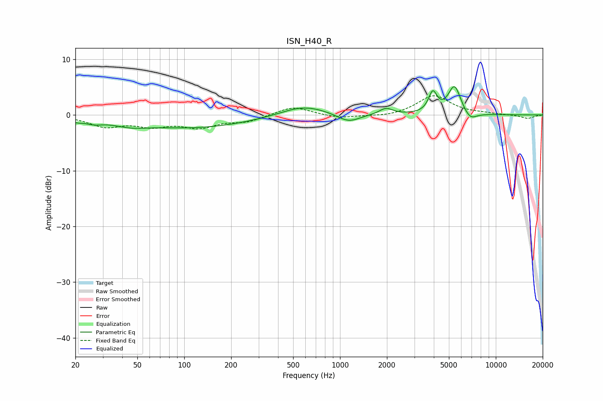

# ISN_H40_R
See [usage instructions](https://github.com/jaakkopasanen/AutoEq#usage) for more options and info.

### Parametric EQs
Apply preamp of -5.2 dB when using parametric equalizer.

|   # | Type    |   Fc (Hz) |    Q |   Gain (dB) |
|-----|---------|-----------|------|-------------|
|   1 | Peaking |        20 | 3.61 |        -0.6 |
|   2 | Peaking |        26 | 2.46 |        -0.7 |
|   3 | Peaking |        45 | 1.37 |        -0.8 |
|   4 | Peaking |       112 | 0.37 |        -2.3 |
|   5 | Peaking |       582 | 0.95 |         1.9 |
|   6 | Peaking |      1134 | 1.93 |        -1.6 |
|   7 | Peaking |      1973 | 3.32 |         1.2 |
|   8 | Peaking |      3940 | 5.21 |         3.6 |
|   9 | Peaking |      5431 | 3.4  |         5.2 |
|  10 | Peaking |      6830 | 3.24 |        -1.5 |

### Fixed Band EQs
When using fixed band (also called graphic) equalizer, apply preamp of **-3.5 dB** (if available) and set gains manually with these parameters.

|   # | Type    |   Fc (Hz) |    Q |   Gain (dB) |
|-----|---------|-----------|------|-------------|
|   1 | Peaking |        31 | 1.41 |        -1.9 |
|   2 | Peaking |        62 | 1.41 |        -1.7 |
|   3 | Peaking |       125 | 1.41 |        -2   |
|   4 | Peaking |       250 | 1.41 |        -1.1 |
|   5 | Peaking |       500 | 1.41 |         1.6 |
|   6 | Peaking |      1000 | 1.41 |        -0.6 |
|   7 | Peaking |      2000 | 1.41 |        -0.4 |
|   8 | Peaking |      4000 | 1.41 |         3.5 |
|   9 | Peaking |      8000 | 1.41 |         0.2 |
|  10 | Peaking |     16000 | 1.41 |        -0.6 |

### Graphs

