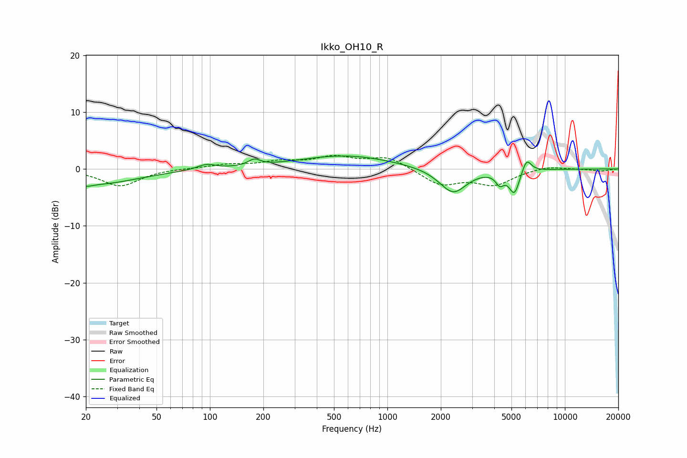

# Ikko_OH10_R
See [usage instructions](https://github.com/jaakkopasanen/AutoEq#usage) for more options and info.

### Parametric EQs
Apply preamp of -2.4 dB when using parametric equalizer.

|   # | Type    |   Fc (Hz) |    Q |   Gain (dB) |
|-----|---------|-----------|------|-------------|
|   1 | Peaking |        20 | 3.94 |        -0.6 |
|   2 | Peaking |        24 | 0.63 |        -2.6 |
|   3 | Peaking |        95 | 2.82 |         0.9 |
|   4 | Peaking |       178 | 4.18 |         1.1 |
|   5 | Peaking |       580 | 0.52 |         2.4 |
|   6 | Peaking |      2221 | 2.88 |         0.3 |
|   7 | Peaking |      2331 | 1.88 |        -4.7 |
|   8 | Peaking |      4301 | 6    |        -1.9 |
|   9 | Peaking |      5195 | 4.67 |        -4.2 |
|  10 | Peaking |      6081 | 5.26 |         2.5 |

### Fixed Band EQs
When using fixed band (also called graphic) equalizer, apply preamp of **-2.5 dB** (if available) and set gains manually with these parameters.

|   # | Type    |   Fc (Hz) |    Q |   Gain (dB) |
|-----|---------|-----------|------|-------------|
|   1 | Peaking |        31 | 1.41 |        -3   |
|   2 | Peaking |        62 | 1.41 |         0.1 |
|   3 | Peaking |       125 | 1.41 |         0.7 |
|   4 | Peaking |       250 | 1.41 |         1.1 |
|   5 | Peaking |       500 | 1.41 |         1.9 |
|   6 | Peaking |      1000 | 1.41 |         2.1 |
|   7 | Peaking |      2000 | 1.41 |        -2.8 |
|   8 | Peaking |      4000 | 1.41 |        -2.6 |
|   9 | Peaking |      8000 | 1.41 |         0.6 |
|  10 | Peaking |     16000 | 1.41 |        -0.4 |

### Graphs

