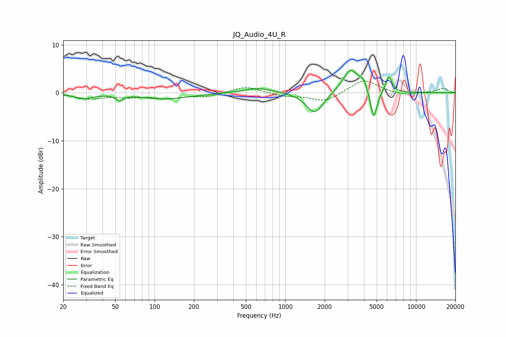

# JQ_Audio_4U_R
See [usage instructions](https://github.com/jaakkopasanen/AutoEq#usage) for more options and info.

### Parametric EQs
Apply preamp of -4.7 dB when using parametric equalizer.

|   # | Type    |   Fc (Hz) |    Q |   Gain (dB) |
|-----|---------|-----------|------|-------------|
|   1 | Peaking |        28 | 2.05 |        -1.1 |
|   2 | Peaking |        54 | 5.27 |        -1.1 |
|   3 | Peaking |        73 | 1.36 |         0   |
|   4 | Peaking |       120 | 0.75 |        -1.3 |
|   5 | Peaking |       626 | 1.31 |         1.1 |
|   6 | Peaking |      1679 | 2.14 |        -4.5 |
|   7 | Peaking |      3158 | 2.3  |         5.1 |
|   8 | Peaking |      3975 | 4.82 |         1.8 |
|   9 | Peaking |      4736 | 5.32 |        -6.3 |
|  10 | Peaking |      6187 | 5.49 |         3.5 |

### Fixed Band EQs
When using fixed band (also called graphic) equalizer, apply preamp of **-2.5 dB** (if available) and set gains manually with these parameters.

|   # | Type    |   Fc (Hz) |    Q |   Gain (dB) |
|-----|---------|-----------|------|-------------|
|   1 | Peaking |        31 | 1.41 |        -1.2 |
|   2 | Peaking |        62 | 1.41 |        -0.7 |
|   3 | Peaking |       125 | 1.41 |        -1   |
|   4 | Peaking |       250 | 1.41 |        -0.7 |
|   5 | Peaking |       500 | 1.41 |         1.4 |
|   6 | Peaking |      1000 | 1.41 |        -0.7 |
|   7 | Peaking |      2000 | 1.41 |        -1.9 |
|   8 | Peaking |      4000 | 1.41 |         2.8 |
|   9 | Peaking |      8000 | 1.41 |        -0.6 |
|  10 | Peaking |     16000 | 1.41 |         0.9 |

### Graphs

