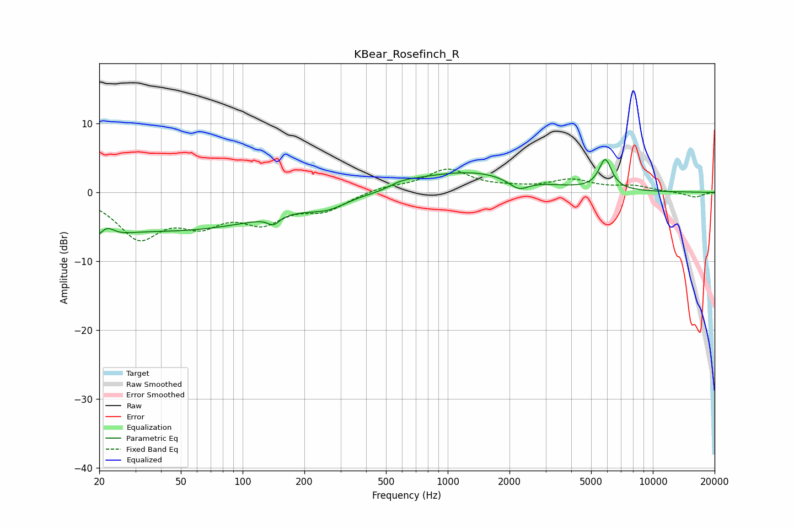

# KBear_Rosefinch_R
See [usage instructions](https://github.com/jaakkopasanen/AutoEq#usage) for more options and info.

### Parametric EQs
Apply preamp of -4.8 dB when using parametric equalizer.

|   # | Type    |   Fc (Hz) |    Q |   Gain (dB) |
|-----|---------|-----------|------|-------------|
|   1 | Peaking |        20 | 1.94 |        -5.7 |
|   2 | Peaking |        21 | 3.11 |         4.2 |
|   3 | Peaking |        48 | 0.29 |        -5.3 |
|   4 | Peaking |       141 | 5.09 |        -1.2 |
|   5 | Peaking |       262 | 1.49 |        -1.4 |
|   6 | Peaking |       484 | 1.89 |        -0.6 |
|   7 | Peaking |       574 | 1.64 |         0.9 |
|   8 | Peaking |      1259 | 0.52 |         3   |
|   9 | Peaking |      2221 | 2.84 |        -1.6 |
|  10 | Peaking |      5863 | 4.43 |         4.4 |

### Fixed Band EQs
When using fixed band (also called graphic) equalizer, apply preamp of **-3.5 dB** (if available) and set gains manually with these parameters.

|   # | Type    |   Fc (Hz) |    Q |   Gain (dB) |
|-----|---------|-----------|------|-------------|
|   1 | Peaking |        31 | 1.41 |        -6.2 |
|   2 | Peaking |        62 | 1.41 |        -3.7 |
|   3 | Peaking |       125 | 1.41 |        -3.7 |
|   4 | Peaking |       250 | 1.41 |        -2.3 |
|   5 | Peaking |       500 | 1.41 |         0.7 |
|   6 | Peaking |      1000 | 1.41 |         3.2 |
|   7 | Peaking |      2000 | 1.41 |         0.4 |
|   8 | Peaking |      4000 | 1.41 |         1.7 |
|   9 | Peaking |      8000 | 1.41 |         0.8 |
|  10 | Peaking |     16000 | 1.41 |        -0.7 |

### Graphs

