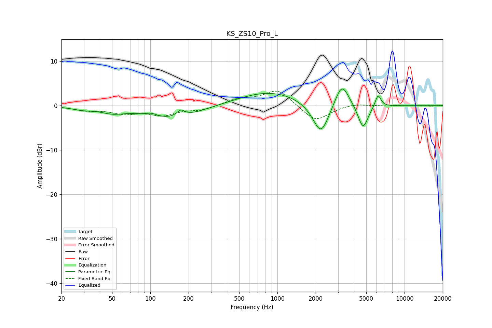

# KS_ZS10_Pro_L
See [usage instructions](https://github.com/jaakkopasanen/AutoEq#usage) for more options and info.

### Parametric EQs
Apply preamp of -3.9 dB when using parametric equalizer.

|   # | Type    |   Fc (Hz) |    Q |   Gain (dB) |
|-----|---------|-----------|------|-------------|
|   1 | Peaking |        29 | 1.76 |        -0.6 |
|   2 | Peaking |        50 | 1.53 |        -1.2 |
|   3 | Peaking |       102 | 3.51 |         0.6 |
|   4 | Peaking |       149 | 0.67 |        -3   |
|   5 | Peaking |       174 | 4.33 |         1.5 |
|   6 | Peaking |       876 | 0.56 |         3.3 |
|   7 | Peaking |      2200 | 2.15 |        -7.5 |
|   8 | Peaking |      3212 | 2.57 |         5.6 |
|   9 | Peaking |      4715 | 3.47 |        -5.5 |
|  10 | Peaking |      6189 | 6    |         2.9 |

### Fixed Band EQs
When using fixed band (also called graphic) equalizer, apply preamp of **-3.4 dB** (if available) and set gains manually with these parameters.

|   # | Type    |   Fc (Hz) |    Q |   Gain (dB) |
|-----|---------|-----------|------|-------------|
|   1 | Peaking |        31 | 1.41 |        -0.9 |
|   2 | Peaking |        62 | 1.41 |        -1.5 |
|   3 | Peaking |       125 | 1.41 |        -1.9 |
|   4 | Peaking |       250 | 1.41 |        -0.9 |
|   5 | Peaking |       500 | 1.41 |         1.4 |
|   6 | Peaking |      1000 | 1.41 |         3.7 |
|   7 | Peaking |      2000 | 1.41 |        -3.7 |
|   8 | Peaking |      4000 | 1.41 |         0.6 |
|   9 | Peaking |      8000 | 1.41 |        -0.1 |
|  10 | Peaking |     16000 | 1.41 |        -0.1 |

### Graphs

