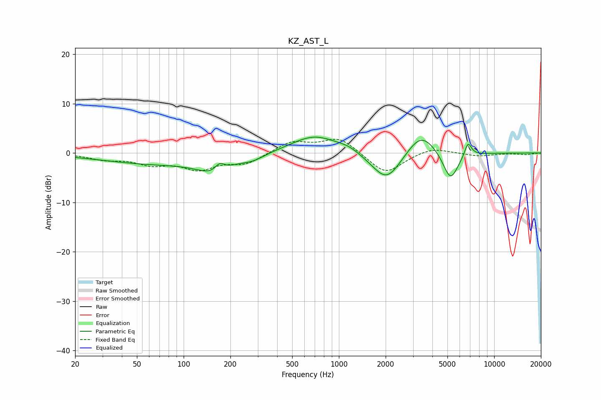

# KZ_AST_L
See [usage instructions](https://github.com/jaakkopasanen/AutoEq#usage) for more options and info.

### Parametric EQs
Apply preamp of -3.3 dB when using parametric equalizer.

|   # | Type    |   Fc (Hz) |    Q |   Gain (dB) |
|-----|---------|-----------|------|-------------|
|   1 | Peaking |        68 | 0.38 |        -2.1 |
|   2 | Peaking |       158 | 1.37 |        -2.8 |
|   3 | Peaking |       171 | 4.44 |         1.8 |
|   4 | Peaking |       279 | 1.97 |        -1   |
|   5 | Peaking |       696 | 0.93 |         3.7 |
|   6 | Peaking |      1156 | 1.94 |         0.9 |
|   7 | Peaking |      2032 | 1.45 |        -6.3 |
|   8 | Peaking |      3379 | 1.45 |         5   |
|   9 | Peaking |      5232 | 2.75 |        -6   |
|  10 | Peaking |      6788 | 6    |         2.9 |

### Fixed Band EQs
When using fixed band (also called graphic) equalizer, apply preamp of **-2.9 dB** (if available) and set gains manually with these parameters.

|   # | Type    |   Fc (Hz) |    Q |   Gain (dB) |
|-----|---------|-----------|------|-------------|
|   1 | Peaking |        31 | 1.41 |        -1.1 |
|   2 | Peaking |        62 | 1.41 |        -2   |
|   3 | Peaking |       125 | 1.41 |        -3   |
|   4 | Peaking |       250 | 1.41 |        -2.1 |
|   5 | Peaking |       500 | 1.41 |         2.3 |
|   6 | Peaking |      1000 | 1.41 |         3.1 |
|   7 | Peaking |      2000 | 1.41 |        -4.3 |
|   8 | Peaking |      4000 | 1.41 |         1.2 |
|   9 | Peaking |      8000 | 1.41 |        -0.6 |
|  10 | Peaking |     16000 | 1.41 |        -0.3 |

### Graphs

