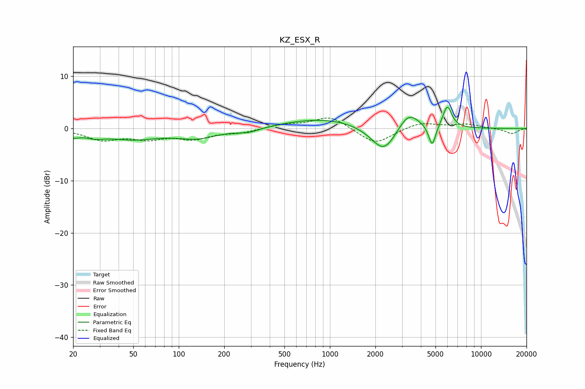

# KZ_ESX_R
See [usage instructions](https://github.com/jaakkopasanen/AutoEq#usage) for more options and info.

### Parametric EQs
Apply preamp of -4.2 dB when using parametric equalizer.

|   # | Type    |   Fc (Hz) |    Q |   Gain (dB) |
|-----|---------|-----------|------|-------------|
|   1 | Peaking |        20 | 3.32 |        -1   |
|   2 | Peaking |        28 | 2.11 |        -0.9 |
|   3 | Peaking |        49 | 0.82 |        -1.9 |
|   4 | Peaking |       133 | 1.06 |        -1.7 |
|   5 | Peaking |       289 | 1.85 |        -0.8 |
|   6 | Peaking |       915 | 0.54 |         1.9 |
|   7 | Peaking |      2278 | 1.67 |        -5.3 |
|   8 | Peaking |      3308 | 1.98 |         3.7 |
|   9 | Peaking |      4755 | 6    |        -4.2 |
|  10 | Peaking |      5982 | 4.6  |         4.2 |

### Fixed Band EQs
When using fixed band (also called graphic) equalizer, apply preamp of **-2.1 dB** (if available) and set gains manually with these parameters.

|   # | Type    |   Fc (Hz) |    Q |   Gain (dB) |
|-----|---------|-----------|------|-------------|
|   1 | Peaking |        31 | 1.41 |        -2   |
|   2 | Peaking |        62 | 1.41 |        -1.7 |
|   3 | Peaking |       125 | 1.41 |        -1.8 |
|   4 | Peaking |       250 | 1.41 |        -0.7 |
|   5 | Peaking |       500 | 1.41 |         0.7 |
|   6 | Peaking |      1000 | 1.41 |         2.4 |
|   7 | Peaking |      2000 | 1.41 |        -3.1 |
|   8 | Peaking |      4000 | 1.41 |         1.2 |
|   9 | Peaking |      8000 | 1.41 |         0.8 |
|  10 | Peaking |     16000 | 1.41 |        -1   |

### Graphs

