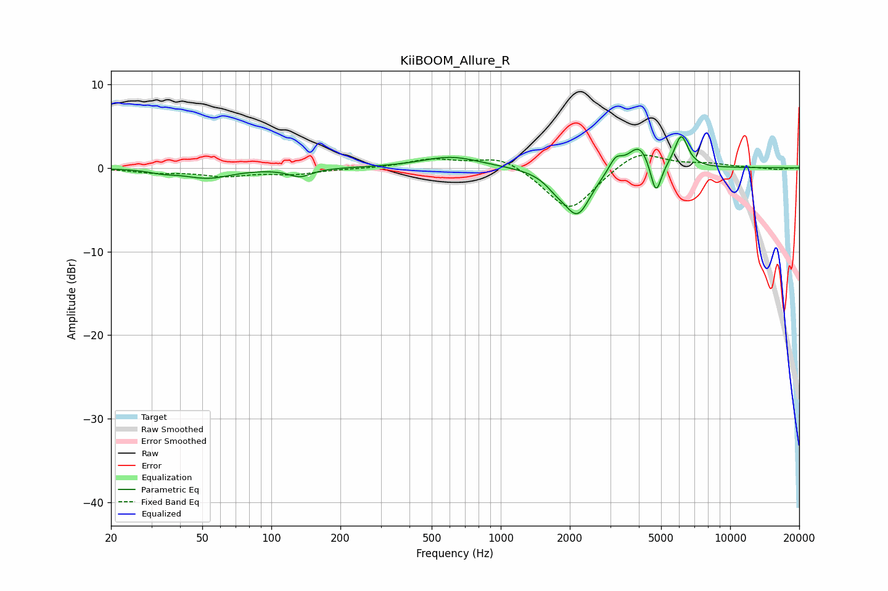

# KiiBOOM_Allure_R
See [usage instructions](https://github.com/jaakkopasanen/AutoEq#usage) for more options and info.

### Parametric EQs
Apply preamp of -3.8 dB when using parametric equalizer.

|   # | Type    |   Fc (Hz) |    Q |   Gain (dB) |
|-----|---------|-----------|------|-------------|
|   1 | Peaking |        34 | 2.36 |        -0.4 |
|   2 | Peaking |        53 | 1.39 |        -1.2 |
|   3 | Peaking |       133 | 2.87 |        -1   |
|   4 | Peaking |       608 | 1.11 |         1.4 |
|   5 | Peaking |      1746 | 2.9  |        -1.2 |
|   6 | Peaking |      2162 | 2.42 |        -5.4 |
|   7 | Peaking |      3168 | 4.88 |         1.6 |
|   8 | Peaking |      4027 | 2.91 |         3   |
|   9 | Peaking |      4746 | 5.86 |        -4.2 |
|  10 | Peaking |      6120 | 4.75 |         3.8 |

### Fixed Band EQs
When using fixed band (also called graphic) equalizer, apply preamp of **-1.6 dB** (if available) and set gains manually with these parameters.

|   # | Type    |   Fc (Hz) |    Q |   Gain (dB) |
|-----|---------|-----------|------|-------------|
|   1 | Peaking |        31 | 1.41 |        -0.5 |
|   2 | Peaking |        62 | 1.41 |        -0.9 |
|   3 | Peaking |       125 | 1.41 |        -0.7 |
|   4 | Peaking |       250 | 1.41 |        -0.1 |
|   5 | Peaking |       500 | 1.41 |         1   |
|   6 | Peaking |      1000 | 1.41 |         1.5 |
|   7 | Peaking |      2000 | 1.41 |        -5.3 |
|   8 | Peaking |      4000 | 1.41 |         2.2 |
|   9 | Peaking |      8000 | 1.41 |         0.4 |
|  10 | Peaking |     16000 | 1.41 |        -0.2 |

### Graphs

