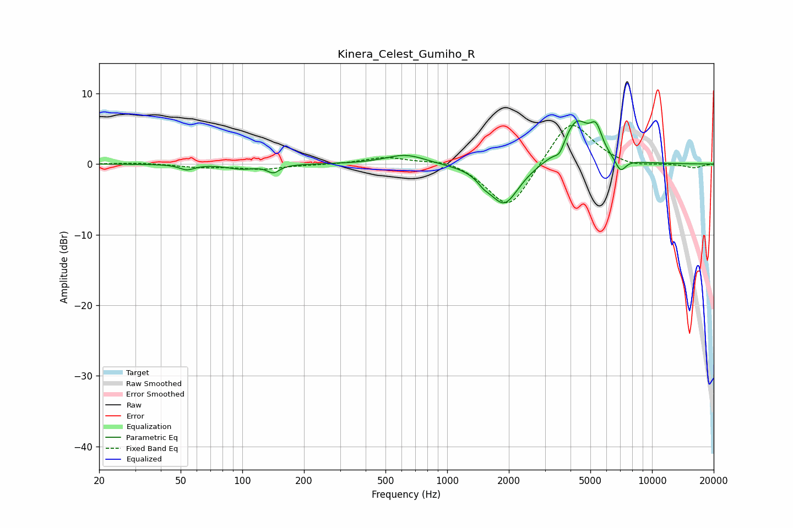

# Kinera_Celest_Gumiho_R
See [usage instructions](https://github.com/jaakkopasanen/AutoEq#usage) for more options and info.

### Parametric EQs
Apply preamp of -6.2 dB when using parametric equalizer.

|   # | Type    |   Fc (Hz) |    Q |   Gain (dB) |
|-----|---------|-----------|------|-------------|
|   1 | Peaking |        54 | 4.05 |        -0.7 |
|   2 | Peaking |        99 | 2.08 |        -0.6 |
|   3 | Peaking |       142 | 4.84 |        -1.1 |
|   4 | Peaking |       627 | 1.44 |         1.4 |
|   5 | Peaking |      1507 | 4.59 |        -0.8 |
|   6 | Peaking |      1898 | 1.94 |        -5.8 |
|   7 | Peaking |      3539 | 6    |        -1.4 |
|   8 | Peaking |      4270 | 2.07 |         6.2 |
|   9 | Peaking |      5334 | 4.77 |         3.2 |
|  10 | Peaking |      7016 | 5.16 |        -1.9 |

### Fixed Band EQs
When using fixed band (also called graphic) equalizer, apply preamp of **-5.6 dB** (if available) and set gains manually with these parameters.

|   # | Type    |   Fc (Hz) |    Q |   Gain (dB) |
|-----|---------|-----------|------|-------------|
|   1 | Peaking |        31 | 1.41 |         0.2 |
|   2 | Peaking |        62 | 1.41 |        -0.4 |
|   3 | Peaking |       125 | 1.41 |        -0.7 |
|   4 | Peaking |       250 | 1.41 |        -0.1 |
|   5 | Peaking |       500 | 1.41 |         1   |
|   6 | Peaking |      1000 | 1.41 |         0.8 |
|   7 | Peaking |      2000 | 1.41 |        -6.8 |
|   8 | Peaking |      4000 | 1.41 |         6.7 |
|   9 | Peaking |      8000 | 1.41 |        -0.6 |
|  10 | Peaking |     16000 | 1.41 |        -0.6 |

### Graphs

