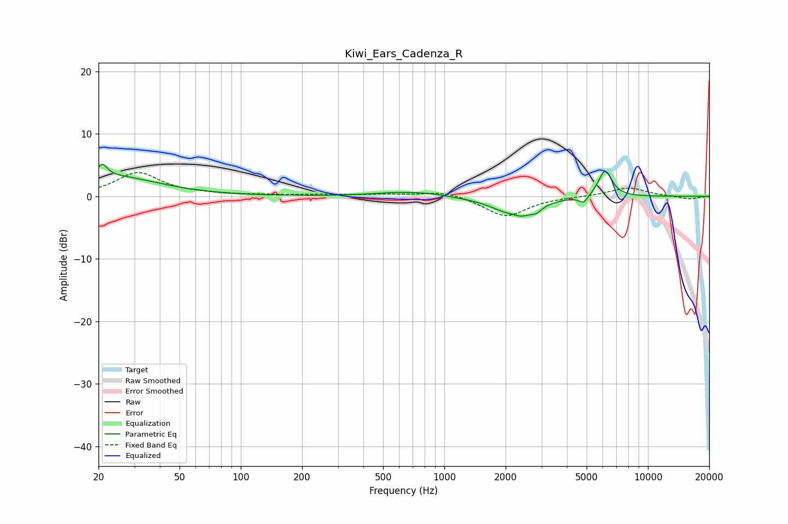

# Kiwi_Ears_Cadenza_R
See [usage instructions](https://github.com/jaakkopasanen/AutoEq#usage) for more options and info.

### Parametric EQs
Apply preamp of -5.2 dB when using parametric equalizer.

|   # | Type    |   Fc (Hz) |    Q |   Gain (dB) |
|-----|---------|-----------|------|-------------|
|   1 | Peaking |        21 | 5.76 |         2.1 |
|   2 | Peaking |        24 | 0.65 |         3.1 |
|   3 | Peaking |       619 | 1.02 |         0.7 |
|   4 | Peaking |       866 | 2.02 |         0.2 |
|   5 | Peaking |      1879 | 1.27 |        -0.5 |
|   6 | Peaking |      2166 | 4.53 |         0.5 |
|   7 | Peaking |      2301 | 1.72 |        -3   |
|   8 | Peaking |      2840 | 5.99 |        -0.7 |
|   9 | Peaking |      4836 | 6    |        -1.2 |
|  10 | Peaking |      6159 | 4.09 |         4.3 |

### Fixed Band EQs
When using fixed band (also called graphic) equalizer, apply preamp of **-3.9 dB** (if available) and set gains manually with these parameters.

|   # | Type    |   Fc (Hz) |    Q |   Gain (dB) |
|-----|---------|-----------|------|-------------|
|   1 | Peaking |        31 | 1.41 |         3.7 |
|   2 | Peaking |        62 | 1.41 |         0.2 |
|   3 | Peaking |       125 | 1.41 |         0.2 |
|   4 | Peaking |       250 | 1.41 |         0.2 |
|   5 | Peaking |       500 | 1.41 |         0.3 |
|   6 | Peaking |      1000 | 1.41 |         0.9 |
|   7 | Peaking |      2000 | 1.41 |        -3.3 |
|   8 | Peaking |      4000 | 1.41 |        -0   |
|   9 | Peaking |      8000 | 1.41 |         1.4 |
|  10 | Peaking |     16000 | 1.41 |        -0.5 |

### Graphs

