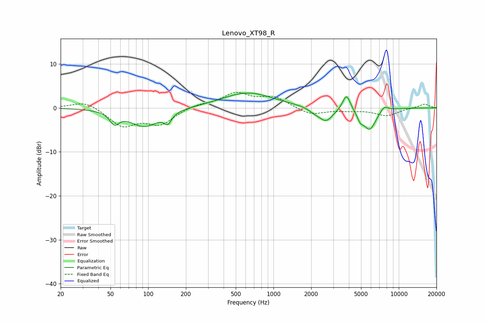

# Lenovo_XT98_R
See [usage instructions](https://github.com/jaakkopasanen/AutoEq#usage) for more options and info.

### Parametric EQs
Apply preamp of -3.5 dB when using parametric equalizer.

|   # | Type    |   Fc (Hz) |    Q |   Gain (dB) |
|-----|---------|-----------|------|-------------|
|   1 | Peaking |        54 | 3.82 |        -2.6 |
|   2 | Peaking |        93 | 1.22 |        -4.2 |
|   3 | Peaking |       143 | 4.74 |        -2.2 |
|   4 | Peaking |       624 | 0.7  |         3.5 |
|   5 | Peaking |      2114 | 3.22 |        -0.7 |
|   6 | Peaking |      2618 | 2.52 |        -3.1 |
|   7 | Peaking |      3824 | 4.54 |         3.7 |
|   8 | Peaking |      4929 | 5.98 |        -1.6 |
|   9 | Peaking |      5852 | 2.71 |        -4.9 |
|  10 | Peaking |      7653 | 4.27 |         1.3 |

### Fixed Band EQs
When using fixed band (also called graphic) equalizer, apply preamp of **-3.7 dB** (if available) and set gains manually with these parameters.

|   # | Type    |   Fc (Hz) |    Q |   Gain (dB) |
|-----|---------|-----------|------|-------------|
|   1 | Peaking |        31 | 1.41 |         1.7 |
|   2 | Peaking |        62 | 1.41 |        -4   |
|   3 | Peaking |       125 | 1.41 |        -3.5 |
|   4 | Peaking |       250 | 1.41 |         0.8 |
|   5 | Peaking |       500 | 1.41 |         3.2 |
|   6 | Peaking |      1000 | 1.41 |         2.3 |
|   7 | Peaking |      2000 | 1.41 |        -1.6 |
|   8 | Peaking |      4000 | 1.41 |        -0.4 |
|   9 | Peaking |      8000 | 1.41 |        -1.7 |
|  10 | Peaking |     16000 | 1.41 |         0.9 |

### Graphs

