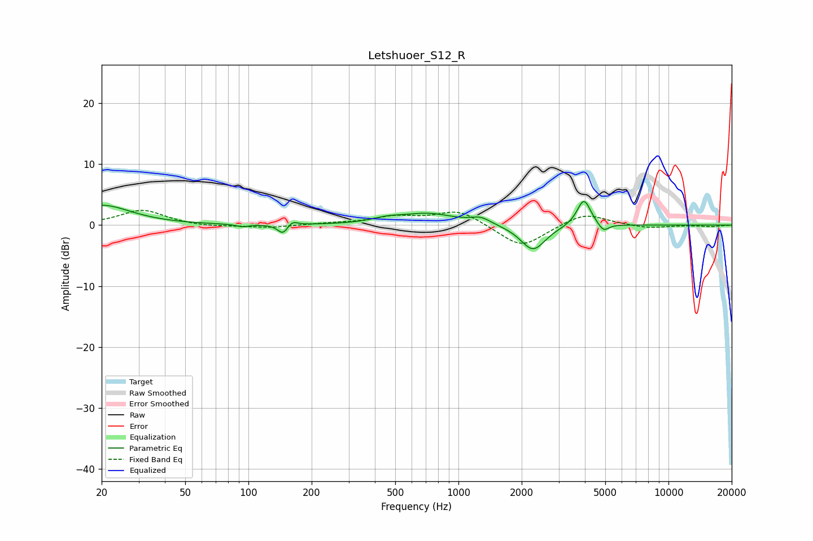

# Letshuoer_S12_R
See [usage instructions](https://github.com/jaakkopasanen/AutoEq#usage) for more options and info.

### Parametric EQs
Apply preamp of -4.0 dB when using parametric equalizer.

|   # | Type    |   Fc (Hz) |    Q |   Gain (dB) |
|-----|---------|-----------|------|-------------|
|   1 | Peaking |        20 | 1.03 |         3.3 |
|   2 | Peaking |        94 | 4.8  |        -0.4 |
|   3 | Peaking |       146 | 5.76 |        -1.6 |
|   4 | Peaking |       161 | 5.91 |         0.9 |
|   5 | Peaking |       455 | 2.04 |         0.6 |
|   6 | Peaking |       714 | 1.09 |         1.8 |
|   7 | Peaking |      1277 | 3    |         1   |
|   8 | Peaking |      2264 | 2.38 |        -4.3 |
|   9 | Peaking |      3955 | 4.3  |         4.5 |
|  10 | Peaking |      4899 | 5.51 |        -1.4 |

### Fixed Band EQs
When using fixed band (also called graphic) equalizer, apply preamp of **-2.5 dB** (if available) and set gains manually with these parameters.

|   # | Type    |   Fc (Hz) |    Q |   Gain (dB) |
|-----|---------|-----------|------|-------------|
|   1 | Peaking |        31 | 1.41 |         2.5 |
|   2 | Peaking |        62 | 1.41 |        -0.3 |
|   3 | Peaking |       125 | 1.41 |        -0.5 |
|   4 | Peaking |       250 | 1.41 |         0.2 |
|   5 | Peaking |       500 | 1.41 |         1.3 |
|   6 | Peaking |      1000 | 1.41 |         2.5 |
|   7 | Peaking |      2000 | 1.41 |        -3.8 |
|   8 | Peaking |      4000 | 1.41 |         2.1 |
|   9 | Peaking |      8000 | 1.41 |        -0.5 |
|  10 | Peaking |     16000 | 1.41 |        -0.2 |

### Graphs

