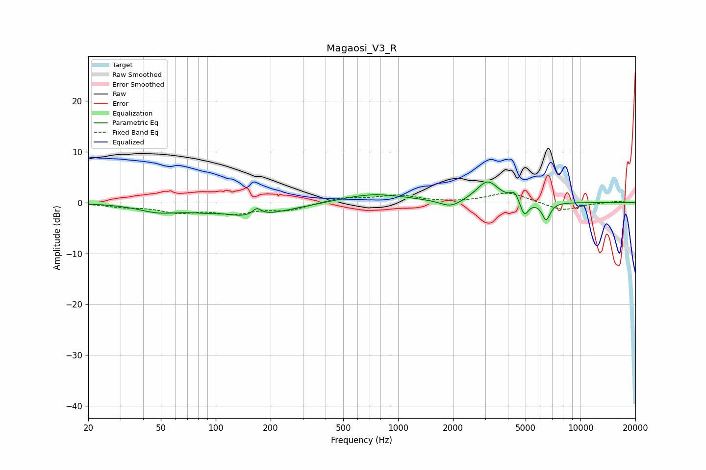

# Magaosi_V3_R
See [usage instructions](https://github.com/jaakkopasanen/AutoEq#usage) for more options and info.

### Parametric EQs
Apply preamp of -4.2 dB when using parametric equalizer.

|   # | Type    |   Fc (Hz) |    Q |   Gain (dB) |
|-----|---------|-----------|------|-------------|
|   1 | Peaking |        48 | 1.36 |        -1.3 |
|   2 | Peaking |       113 | 2.55 |         0.4 |
|   3 | Peaking |       143 | 0.65 |        -2.9 |
|   4 | Peaking |       168 | 5.89 |         1.4 |
|   5 | Peaking |       727 | 0.79 |         1.8 |
|   6 | Peaking |      1946 | 2.42 |        -1.5 |
|   7 | Peaking |      3094 | 2.36 |         4.2 |
|   8 | Peaking |      4357 | 6    |         1.8 |
|   9 | Peaking |      4919 | 6    |        -3.1 |
|  10 | Peaking |      6481 | 6    |        -3.5 |

### Fixed Band EQs
When using fixed band (also called graphic) equalizer, apply preamp of **-2.0 dB** (if available) and set gains manually with these parameters.

|   # | Type    |   Fc (Hz) |    Q |   Gain (dB) |
|-----|---------|-----------|------|-------------|
|   1 | Peaking |        31 | 1.41 |        -0.7 |
|   2 | Peaking |        62 | 1.41 |        -1.7 |
|   3 | Peaking |       125 | 1.41 |        -1.8 |
|   4 | Peaking |       250 | 1.41 |        -1.4 |
|   5 | Peaking |       500 | 1.41 |         1   |
|   6 | Peaking |      1000 | 1.41 |         1.4 |
|   7 | Peaking |      2000 | 1.41 |        -0.1 |
|   8 | Peaking |      4000 | 1.41 |         2.1 |
|   9 | Peaking |      8000 | 1.41 |        -1.6 |
|  10 | Peaking |     16000 | 1.41 |         0.3 |

### Graphs

