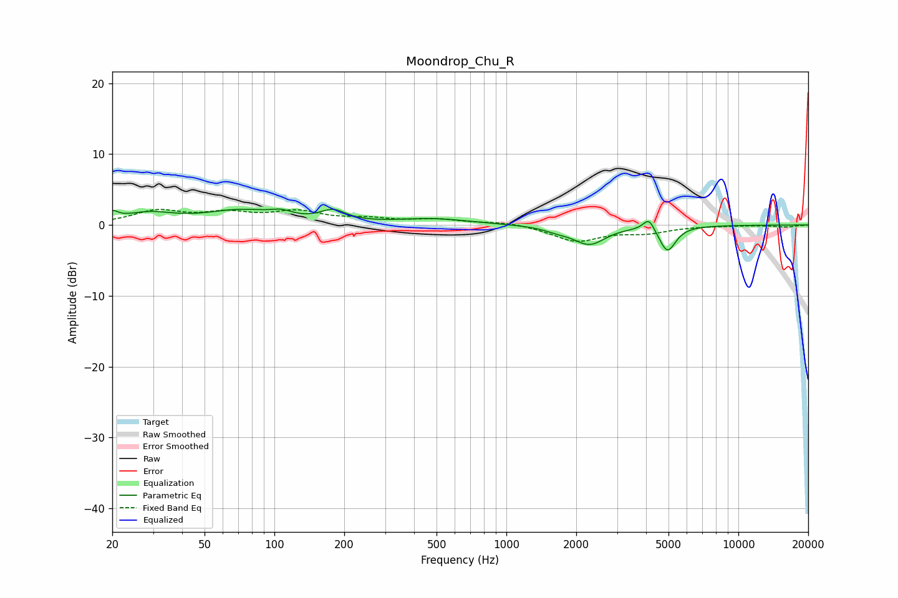

# Moondrop_Chu_R
See [usage instructions](https://github.com/jaakkopasanen/AutoEq#usage) for more options and info.

### Parametric EQs
Apply preamp of -2.4 dB when using parametric equalizer.

|   # | Type    |   Fc (Hz) |    Q |   Gain (dB) |
|-----|---------|-----------|------|-------------|
|   1 | Peaking |        20 | 5.9  |         1.1 |
|   2 | Peaking |        28 | 1.31 |         1.5 |
|   3 | Peaking |        71 | 0.94 |         1.9 |
|   4 | Peaking |       107 | 2.97 |         0.8 |
|   5 | Peaking |       179 | 2.58 |         1.6 |
|   6 | Peaking |       483 | 0.88 |         0.8 |
|   7 | Peaking |      1661 | 2.35 |        -0.5 |
|   8 | Peaking |      2283 | 2.07 |        -2.6 |
|   9 | Peaking |      4114 | 5.78 |         1.8 |
|  10 | Peaking |      4947 | 4    |        -3.6 |

### Fixed Band EQs
When using fixed band (also called graphic) equalizer, apply preamp of **-2.3 dB** (if available) and set gains manually with these parameters.

|   # | Type    |   Fc (Hz) |    Q |   Gain (dB) |
|-----|---------|-----------|------|-------------|
|   1 | Peaking |        31 | 1.41 |         1.9 |
|   2 | Peaking |        62 | 1.41 |         1.4 |
|   3 | Peaking |       125 | 1.41 |         1.7 |
|   4 | Peaking |       250 | 1.41 |         0.7 |
|   5 | Peaking |       500 | 1.41 |         0.7 |
|   6 | Peaking |      1000 | 1.41 |         0.5 |
|   7 | Peaking |      2000 | 1.41 |        -2.2 |
|   8 | Peaking |      4000 | 1.41 |        -0.9 |
|   9 | Peaking |      8000 | 1.41 |        -0.1 |
|  10 | Peaking |     16000 | 1.41 |        -0.3 |

### Graphs

