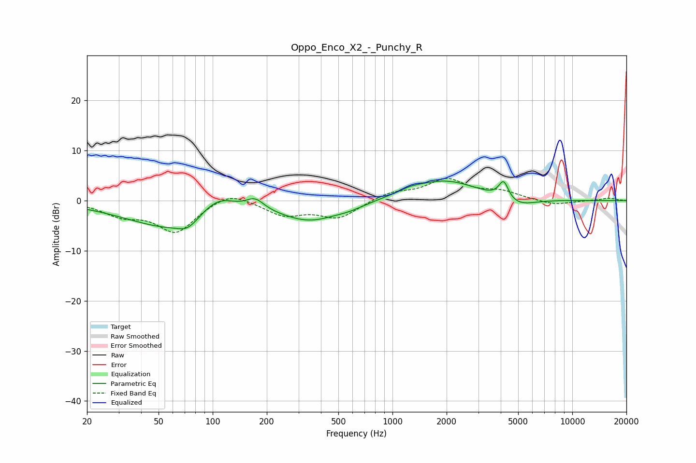

# Oppo_Enco_X2_-_Punchy_R
See [usage instructions](https://github.com/jaakkopasanen/AutoEq#usage) for more options and info.

### Parametric EQs
Apply preamp of -4.0 dB when using parametric equalizer.

|   # | Type    |   Fc (Hz) |    Q |   Gain (dB) |
|-----|---------|-----------|------|-------------|
|   1 | Peaking |        61 | 0.55 |        -5.7 |
|   2 | Peaking |        73 | 2.68 |        -1.7 |
|   3 | Peaking |       107 | 1.35 |         4.3 |
|   4 | Peaking |       172 | 2.81 |         2.2 |
|   5 | Peaking |       349 | 0.87 |        -3.7 |
|   6 | Peaking |       583 | 1.74 |        -0.7 |
|   7 | Peaking |      1250 | 2.41 |         0.6 |
|   8 | Peaking |      1940 | 0.75 |         4.1 |
|   9 | Peaking |      4152 | 5.22 |         3.6 |
|  10 | Peaking |      4939 | 1.48 |        -1.8 |

### Fixed Band EQs
When using fixed band (also called graphic) equalizer, apply preamp of **-4.5 dB** (if available) and set gains manually with these parameters.

|   # | Type    |   Fc (Hz) |    Q |   Gain (dB) |
|-----|---------|-----------|------|-------------|
|   1 | Peaking |        31 | 1.41 |        -2.5 |
|   2 | Peaking |        62 | 1.41 |        -6.1 |
|   3 | Peaking |       125 | 1.41 |         2.2 |
|   4 | Peaking |       250 | 1.41 |        -2.8 |
|   5 | Peaking |       500 | 1.41 |        -3.4 |
|   6 | Peaking |      1000 | 1.41 |         1.6 |
|   7 | Peaking |      2000 | 1.41 |         4   |
|   8 | Peaking |      4000 | 1.41 |         1.6 |
|   9 | Peaking |      8000 | 1.41 |        -0.9 |
|  10 | Peaking |     16000 | 1.41 |         0.5 |

### Graphs

