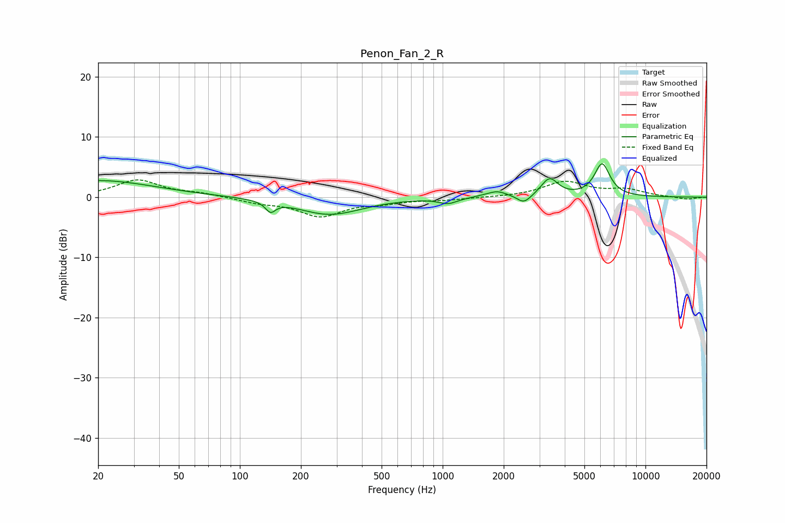

# Penon_Fan_2_R
See [usage instructions](https://github.com/jaakkopasanen/AutoEq#usage) for more options and info.

### Parametric EQs
Apply preamp of -5.6 dB when using parametric equalizer.

|   # | Type    |   Fc (Hz) |    Q |   Gain (dB) |
|-----|---------|-----------|------|-------------|
|   1 | Peaking |        20 | 0.51 |         2.8 |
|   2 | Peaking |       142 | 5.8  |        -1.7 |
|   3 | Peaking |       278 | 0.9  |        -2.9 |
|   4 | Peaking |      1064 | 3.16 |        -0.9 |
|   5 | Peaking |      1608 | 3.21 |         0.2 |
|   6 | Peaking |      1864 | 3.04 |         0.9 |
|   7 | Peaking |      2506 | 4.39 |        -1.3 |
|   8 | Peaking |      2718 | 5.01 |        -0.2 |
|   9 | Peaking |      3366 | 3.4  |         3   |
|  10 | Peaking |      6114 | 3.6  |         5.4 |

### Fixed Band EQs
When using fixed band (also called graphic) equalizer, apply preamp of **-3.0 dB** (if available) and set gains manually with these parameters.

|   # | Type    |   Fc (Hz) |    Q |   Gain (dB) |
|-----|---------|-----------|------|-------------|
|   1 | Peaking |        31 | 1.41 |         2.8 |
|   2 | Peaking |        62 | 1.41 |         0.6 |
|   3 | Peaking |       125 | 1.41 |        -0.8 |
|   4 | Peaking |       250 | 1.41 |        -3   |
|   5 | Peaking |       500 | 1.41 |        -0.8 |
|   6 | Peaking |      1000 | 1.41 |        -0.4 |
|   7 | Peaking |      2000 | 1.41 |        -0   |
|   8 | Peaking |      4000 | 1.41 |         2.5 |
|   9 | Peaking |      8000 | 1.41 |         1.1 |
|  10 | Peaking |     16000 | 1.41 |        -0.4 |

### Graphs

