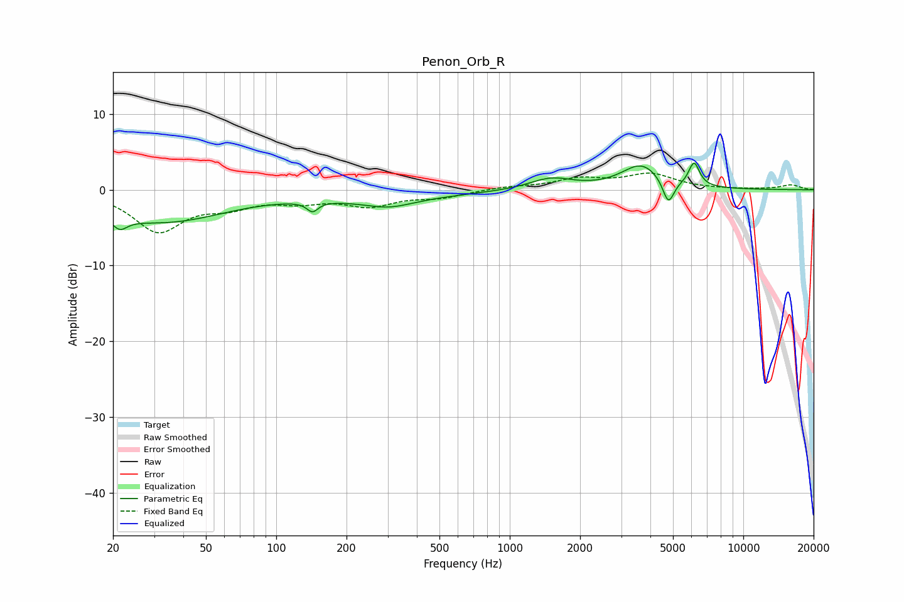

# Penon_Orb_R
See [usage instructions](https://github.com/jaakkopasanen/AutoEq#usage) for more options and info.

### Parametric EQs
Apply preamp of -3.6 dB when using parametric equalizer.

|   # | Type    |   Fc (Hz) |    Q |   Gain (dB) |
|-----|---------|-----------|------|-------------|
|   1 | Peaking |        21 | 4.49 |        -1.5 |
|   2 | Peaking |        27 | 0.47 |        -3.1 |
|   3 | Peaking |        40 | 0.65 |        -1.2 |
|   4 | Peaking |       143 | 5.97 |        -1.3 |
|   5 | Peaking |       268 | 0.39 |        -0.9 |
|   6 | Peaking |       304 | 1.32 |        -1.2 |
|   7 | Peaking |      1502 | 1.53 |         1.5 |
|   8 | Peaking |      3664 | 1.67 |         3.2 |
|   9 | Peaking |      4776 | 5.75 |        -3.3 |
|  10 | Peaking |      6155 | 6    |         3.1 |

### Fixed Band EQs
When using fixed band (also called graphic) equalizer, apply preamp of **-2.3 dB** (if available) and set gains manually with these parameters.

|   # | Type    |   Fc (Hz) |    Q |   Gain (dB) |
|-----|---------|-----------|------|-------------|
|   1 | Peaking |        31 | 1.41 |        -5.3 |
|   2 | Peaking |        62 | 1.41 |        -1.7 |
|   3 | Peaking |       125 | 1.41 |        -1.3 |
|   4 | Peaking |       250 | 1.41 |        -1.9 |
|   5 | Peaking |       500 | 1.41 |        -0.9 |
|   6 | Peaking |      1000 | 1.41 |         0.4 |
|   7 | Peaking |      2000 | 1.41 |         1.3 |
|   8 | Peaking |      4000 | 1.41 |         2   |
|   9 | Peaking |      8000 | 1.41 |         0   |
|  10 | Peaking |     16000 | 1.41 |         0.6 |

### Graphs

