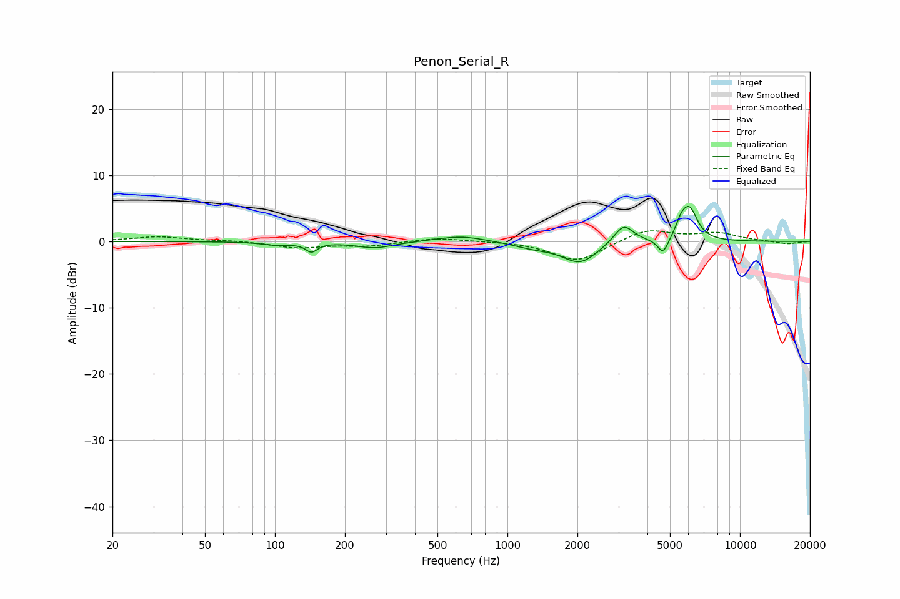

# Penon_Serial_R
See [usage instructions](https://github.com/jaakkopasanen/AutoEq#usage) for more options and info.

### Parametric EQs
Apply preamp of -5.4 dB when using parametric equalizer.

|   # | Type    |   Fc (Hz) |    Q |   Gain (dB) |
|-----|---------|-----------|------|-------------|
|   1 | Peaking |       102 | 2.32 |        -0.5 |
|   2 | Peaking |       144 | 5.7  |        -1.4 |
|   3 | Peaking |       270 | 1.74 |        -1   |
|   4 | Peaking |       631 | 1.37 |         0.9 |
|   5 | Peaking |      1293 | 1.64 |        -0.7 |
|   6 | Peaking |      2049 | 1.87 |        -3.2 |
|   7 | Peaking |      3161 | 3.36 |         2.9 |
|   8 | Peaking |      4671 | 6    |        -2.4 |
|   9 | Peaking |      5592 | 5.94 |         1.9 |
|  10 | Peaking |      6082 | 4.08 |         4.6 |

### Fixed Band EQs
When using fixed band (also called graphic) equalizer, apply preamp of **-1.7 dB** (if available) and set gains manually with these parameters.

|   # | Type    |   Fc (Hz) |    Q |   Gain (dB) |
|-----|---------|-----------|------|-------------|
|   1 | Peaking |        31 | 1.41 |         0.7 |
|   2 | Peaking |        62 | 1.41 |         0.2 |
|   3 | Peaking |       125 | 1.41 |        -0.9 |
|   4 | Peaking |       250 | 1.41 |        -0.6 |
|   5 | Peaking |       500 | 1.41 |         0.6 |
|   6 | Peaking |      1000 | 1.41 |         0.1 |
|   7 | Peaking |      2000 | 1.41 |        -3.1 |
|   8 | Peaking |      4000 | 1.41 |         1.9 |
|   9 | Peaking |      8000 | 1.41 |         1.2 |
|  10 | Peaking |     16000 | 1.41 |        -0.4 |

### Graphs

