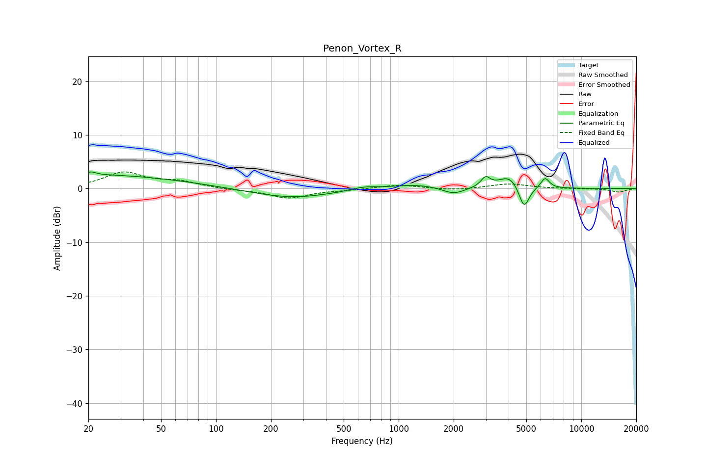

# Penon_Vortex_R
See [usage instructions](https://github.com/jaakkopasanen/AutoEq#usage) for more options and info.

### Parametric EQs
Apply preamp of -3.2 dB when using parametric equalizer.

|   # | Type    |   Fc (Hz) |    Q |   Gain (dB) |
|-----|---------|-----------|------|-------------|
|   1 | Peaking |        20 | 0.26 |         2.6 |
|   2 | Peaking |        21 | 5.75 |         0.5 |
|   3 | Peaking |       258 | 0.65 |        -1.8 |
|   4 | Peaking |       640 | 2.01 |         0.6 |
|   5 | Peaking |      1239 | 0.98 |         0.8 |
|   6 | Peaking |      1998 | 2.27 |        -1.3 |
|   7 | Peaking |      2989 | 5.69 |         1.8 |
|   8 | Peaking |      4052 | 2.35 |         2.5 |
|   9 | Peaking |      4856 | 4.83 |        -4.5 |
|  10 | Peaking |      6331 | 5.82 |         2   |

### Fixed Band EQs
When using fixed band (also called graphic) equalizer, apply preamp of **-3.2 dB** (if available) and set gains manually with these parameters.

|   # | Type    |   Fc (Hz) |    Q |   Gain (dB) |
|-----|---------|-----------|------|-------------|
|   1 | Peaking |        31 | 1.41 |         2.9 |
|   2 | Peaking |        62 | 1.41 |         1.2 |
|   3 | Peaking |       125 | 1.41 |        -0.2 |
|   4 | Peaking |       250 | 1.41 |        -1.8 |
|   5 | Peaking |       500 | 1.41 |        -0.2 |
|   6 | Peaking |      1000 | 1.41 |         0.7 |
|   7 | Peaking |      2000 | 1.41 |        -0.3 |
|   8 | Peaking |      4000 | 1.41 |         0.9 |
|   9 | Peaking |      8000 | 1.41 |        -0   |
|  10 | Peaking |     16000 | 1.41 |        -0.7 |

### Graphs

