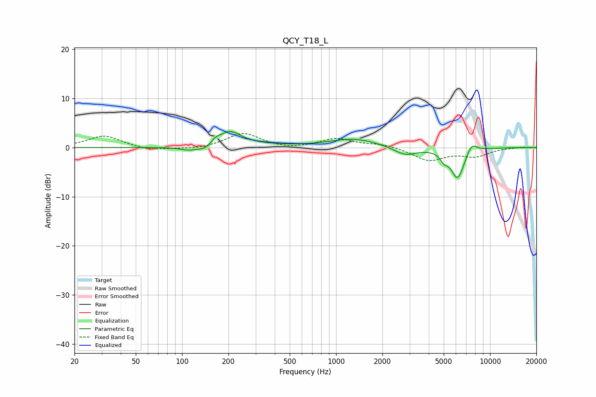

# QCY_T18_L
See [usage instructions](https://github.com/jaakkopasanen/AutoEq#usage) for more options and info.

### Parametric EQs
Apply preamp of -3.3 dB when using parametric equalizer.

|   # | Type    |   Fc (Hz) |    Q |   Gain (dB) |
|-----|---------|-----------|------|-------------|
|   1 | Peaking |       108 | 2.64 |        -0.5 |
|   2 | Peaking |       146 | 2    |        -1.5 |
|   3 | Peaking |       163 | 4.78 |         1.1 |
|   4 | Peaking |       201 | 1.83 |         3.4 |
|   5 | Peaking |       321 | 0.81 |         0.4 |
|   6 | Peaking |      1303 | 0.91 |         1.8 |
|   7 | Peaking |      2818 | 1.93 |        -1.7 |
|   8 | Peaking |      5018 | 6    |        -1.4 |
|   9 | Peaking |      6149 | 3.09 |        -6.3 |
|  10 | Peaking |      7601 | 4.05 |         2   |

### Fixed Band EQs
When using fixed band (also called graphic) equalizer, apply preamp of **-2.9 dB** (if available) and set gains manually with these parameters.

|   # | Type    |   Fc (Hz) |    Q |   Gain (dB) |
|-----|---------|-----------|------|-------------|
|   1 | Peaking |        31 | 1.41 |         2.4 |
|   2 | Peaking |        62 | 1.41 |        -0.7 |
|   3 | Peaking |       125 | 1.41 |        -0.4 |
|   4 | Peaking |       250 | 1.41 |         2.9 |
|   5 | Peaking |       500 | 1.41 |        -0.5 |
|   6 | Peaking |      1000 | 1.41 |         1.8 |
|   7 | Peaking |      2000 | 1.41 |         0.7 |
|   8 | Peaking |      4000 | 1.41 |        -2.6 |
|   9 | Peaking |      8000 | 1.41 |        -1.6 |
|  10 | Peaking |     16000 | 1.41 |         0.1 |

### Graphs

