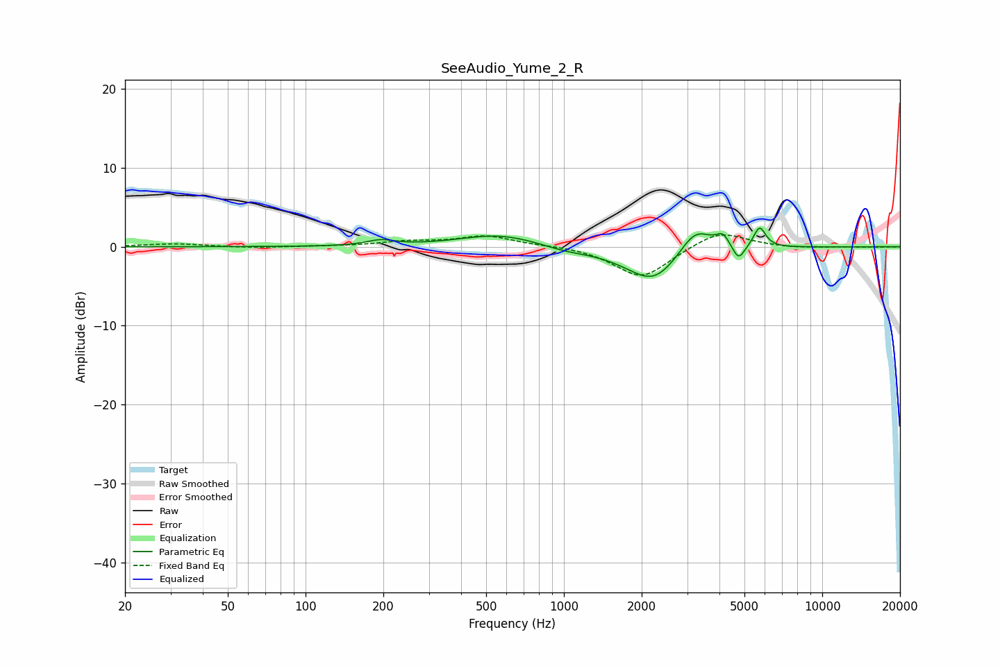

# SeeAudio_Yume_2_R
See [usage instructions](https://github.com/jaakkopasanen/AutoEq#usage) for more options and info.

### Parametric EQs
Apply preamp of -2.5 dB when using parametric equalizer.

|   # | Type    |   Fc (Hz) |    Q |   Gain (dB) |
|-----|---------|-----------|------|-------------|
|   1 | Peaking |       195 | 2.64 |         0.7 |
|   2 | Peaking |       561 | 0.93 |         1.6 |
|   3 | Peaking |      1005 | 1.79 |        -0.4 |
|   4 | Peaking |      1915 | 0.85 |        -0.9 |
|   5 | Peaking |      2234 | 1.51 |        -3.7 |
|   6 | Peaking |      3215 | 2.3  |         2.7 |
|   7 | Peaking |      3299 | 2.15 |         0.6 |
|   8 | Peaking |      4121 | 5.48 |         1.5 |
|   9 | Peaking |      4746 | 6    |        -2   |
|  10 | Peaking |      5724 | 5.99 |         2.6 |

### Fixed Band EQs
When using fixed band (also called graphic) equalizer, apply preamp of **-1.6 dB** (if available) and set gains manually with these parameters.

|   # | Type    |   Fc (Hz) |    Q |   Gain (dB) |
|-----|---------|-----------|------|-------------|
|   1 | Peaking |        31 | 1.41 |         0.4 |
|   2 | Peaking |        62 | 1.41 |        -0.2 |
|   3 | Peaking |       125 | 1.41 |         0   |
|   4 | Peaking |       250 | 1.41 |         0.6 |
|   5 | Peaking |       500 | 1.41 |         1.3 |
|   6 | Peaking |      1000 | 1.41 |         0.2 |
|   7 | Peaking |      2000 | 1.41 |        -4   |
|   8 | Peaking |      4000 | 1.41 |         2.2 |
|   9 | Peaking |      8000 | 1.41 |        -0.2 |
|  10 | Peaking |     16000 | 1.41 |        -0.1 |

### Graphs

