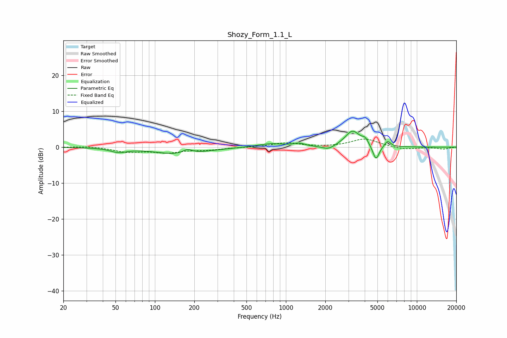

# Shozy_Form_1.1_L
See [usage instructions](https://github.com/jaakkopasanen/AutoEq#usage) for more options and info.

### Parametric EQs
Apply preamp of -4.5 dB when using parametric equalizer.

|   # | Type    |   Fc (Hz) |    Q |   Gain (dB) |
|-----|---------|-----------|------|-------------|
|   1 | Peaking |        53 | 2.3  |        -1.1 |
|   2 | Peaking |       156 | 0.78 |        -2.1 |
|   3 | Peaking |       177 | 3.65 |         1.3 |
|   4 | Peaking |       766 | 1.38 |         1   |
|   5 | Peaking |      1260 | 3.43 |         0.8 |
|   6 | Peaking |      2109 | 2.97 |        -1.1 |
|   7 | Peaking |      3226 | 2.48 |         4.5 |
|   8 | Peaking |      4031 | 5.99 |         1.4 |
|   9 | Peaking |      4874 | 5.76 |        -4.2 |
|  10 | Peaking |      5981 | 6    |         1.7 |

### Fixed Band EQs
When using fixed band (also called graphic) equalizer, apply preamp of **-2.3 dB** (if available) and set gains manually with these parameters.

|   # | Type    |   Fc (Hz) |    Q |   Gain (dB) |
|-----|---------|-----------|------|-------------|
|   1 | Peaking |        31 | 1.41 |         0.3 |
|   2 | Peaking |        62 | 1.41 |        -1.3 |
|   3 | Peaking |       125 | 1.41 |        -1.4 |
|   4 | Peaking |       250 | 1.41 |        -0.7 |
|   5 | Peaking |       500 | 1.41 |        -0.1 |
|   6 | Peaking |      1000 | 1.41 |         1.2 |
|   7 | Peaking |      2000 | 1.41 |        -0   |
|   8 | Peaking |      4000 | 1.41 |         2.3 |
|   9 | Peaking |      8000 | 1.41 |        -0.7 |
|  10 | Peaking |     16000 | 1.41 |        -0.5 |

### Graphs

