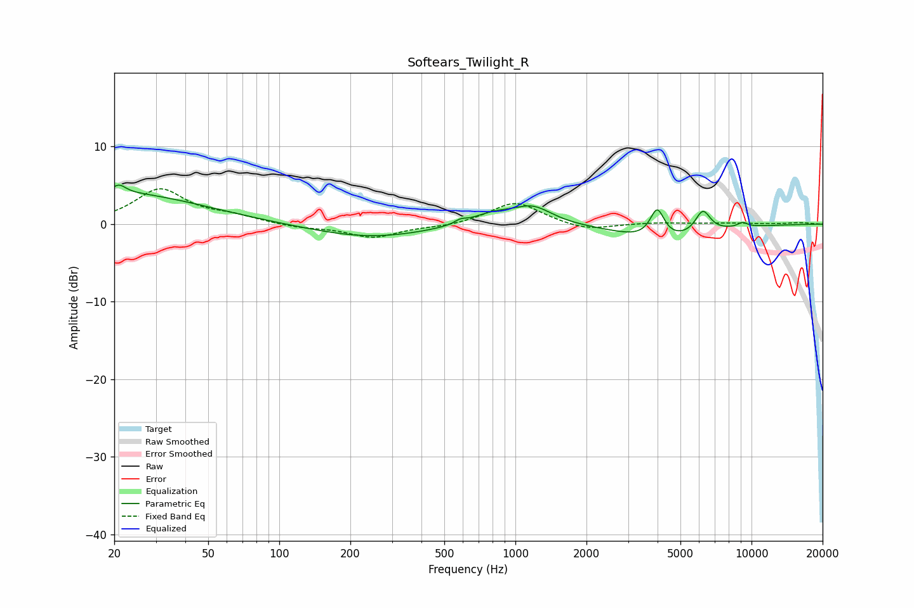

# Softears_Twilight_R
See [usage instructions](https://github.com/jaakkopasanen/AutoEq#usage) for more options and info.

### Parametric EQs
Apply preamp of -5.1 dB when using parametric equalizer.

|   # | Type    |   Fc (Hz) |    Q |   Gain (dB) |
|-----|---------|-----------|------|-------------|
|   1 | Peaking |        20 | 0.39 |         4.1 |
|   2 | Peaking |        21 | 5.18 |         1   |
|   3 | Peaking |       242 | 0.57 |        -1.8 |
|   4 | Peaking |       585 | 5.91 |         0.5 |
|   5 | Peaking |       802 | 1.51 |         1.4 |
|   6 | Peaking |      1186 | 1.72 |         2.2 |
|   7 | Peaking |      3986 | 4.7  |         3.9 |
|   8 | Peaking |      4211 | 0.83 |        -2.3 |
|   9 | Peaking |      6220 | 4.31 |         2.9 |
|  10 | Peaking |      9164 | 5.91 |         0.6 |

### Fixed Band EQs
When using fixed band (also called graphic) equalizer, apply preamp of **-4.6 dB** (if available) and set gains manually with these parameters.

|   # | Type    |   Fc (Hz) |    Q |   Gain (dB) |
|-----|---------|-----------|------|-------------|
|   1 | Peaking |        31 | 1.41 |         4.4 |
|   2 | Peaking |        62 | 1.41 |         0.9 |
|   3 | Peaking |       125 | 1.41 |        -0.5 |
|   4 | Peaking |       250 | 1.41 |        -1.7 |
|   5 | Peaking |       500 | 1.41 |        -0.3 |
|   6 | Peaking |      1000 | 1.41 |         2.9 |
|   7 | Peaking |      2000 | 1.41 |        -0.9 |
|   8 | Peaking |      4000 | 1.41 |         0.2 |
|   9 | Peaking |      8000 | 1.41 |         0.1 |
|  10 | Peaking |     16000 | 1.41 |         0.2 |

### Graphs

