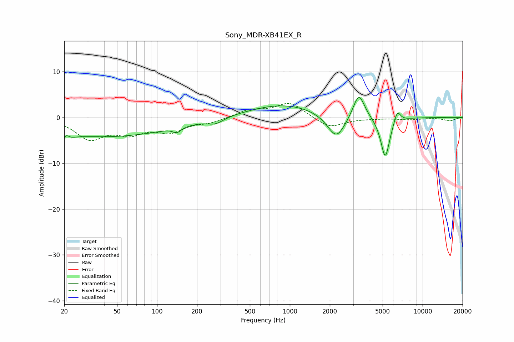

# Sony_MDR-XB41EX_R
See [usage instructions](https://github.com/jaakkopasanen/AutoEq#usage) for more options and info.

### Parametric EQs
Apply preamp of -4.5 dB when using parametric equalizer.

|   # | Type    |   Fc (Hz) |    Q |   Gain (dB) |
|-----|---------|-----------|------|-------------|
|   1 | Peaking |        20 | 3.8  |        -3.8 |
|   2 | Peaking |        21 | 5.81 |         3.1 |
|   3 | Peaking |        42 | 0.28 |        -4.2 |
|   4 | Peaking |       141 | 4.73 |        -1.1 |
|   5 | Peaking |       276 | 2.4  |        -1.2 |
|   6 | Peaking |       899 | 0.53 |         2.9 |
|   7 | Peaking |      2240 | 2.07 |        -5.5 |
|   8 | Peaking |      3308 | 3.23 |         5.7 |
|   9 | Peaking |      5230 | 4.03 |        -9.1 |
|  10 | Peaking |      6441 | 5.74 |         2.7 |

### Fixed Band EQs
When using fixed band (also called graphic) equalizer, apply preamp of **-3.1 dB** (if available) and set gains manually with these parameters.

|   # | Type    |   Fc (Hz) |    Q |   Gain (dB) |
|-----|---------|-----------|------|-------------|
|   1 | Peaking |        31 | 1.41 |        -4.4 |
|   2 | Peaking |        62 | 1.41 |        -2.9 |
|   3 | Peaking |       125 | 1.41 |        -2.8 |
|   4 | Peaking |       250 | 1.41 |        -1   |
|   5 | Peaking |       500 | 1.41 |         1.5 |
|   6 | Peaking |      1000 | 1.41 |         3.2 |
|   7 | Peaking |      2000 | 1.41 |        -2.4 |
|   8 | Peaking |      4000 | 1.41 |        -0.1 |
|   9 | Peaking |      8000 | 1.41 |        -0.4 |
|  10 | Peaking |     16000 | 1.41 |        -0.7 |

### Graphs

