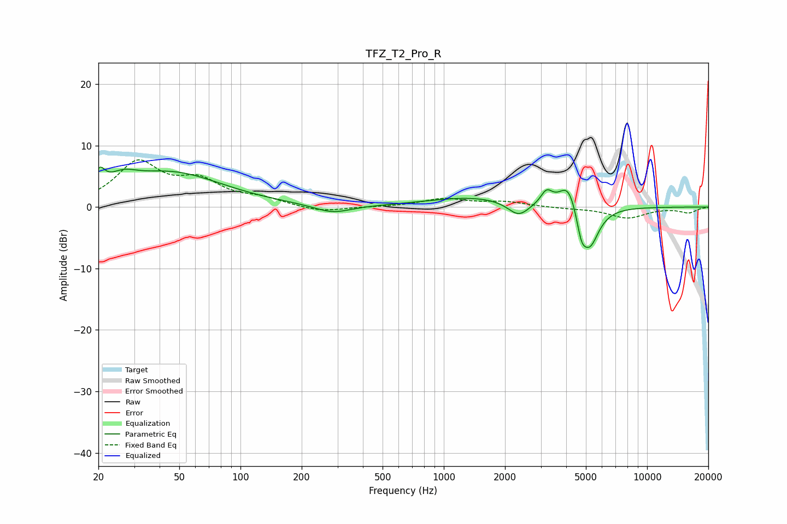

# TFZ_T2_Pro_R
See [usage instructions](https://github.com/jaakkopasanen/AutoEq#usage) for more options and info.

### Parametric EQs
Apply preamp of -6.6 dB when using parametric equalizer.

|   # | Type    |   Fc (Hz) |    Q |   Gain (dB) |
|-----|---------|-----------|------|-------------|
|   1 | Peaking |        20 | 5.6  |         2.8 |
|   2 | Peaking |        26 | 2.07 |         1.9 |
|   3 | Peaking |        45 | 0.55 |         5.5 |
|   4 | Peaking |       284 | 1.56 |        -1.4 |
|   5 | Peaking |      1401 | 0.63 |         1.6 |
|   6 | Peaking |      2333 | 2.69 |        -2.4 |
|   7 | Peaking |      3201 | 5.02 |         2.1 |
|   8 | Peaking |      4109 | 3    |         4.6 |
|   9 | Peaking |      4747 | 5.98 |        -3.4 |
|  10 | Peaking |      5217 | 2.97 |        -6.7 |

### Fixed Band EQs
When using fixed band (also called graphic) equalizer, apply preamp of **-7.8 dB** (if available) and set gains manually with these parameters.

|   # | Type    |   Fc (Hz) |    Q |   Gain (dB) |
|-----|---------|-----------|------|-------------|
|   1 | Peaking |        31 | 1.41 |         7   |
|   2 | Peaking |        62 | 1.41 |         3.7 |
|   3 | Peaking |       125 | 1.41 |         1.1 |
|   4 | Peaking |       250 | 1.41 |        -0.9 |
|   5 | Peaking |       500 | 1.41 |        -0   |
|   6 | Peaking |      1000 | 1.41 |         1.3 |
|   7 | Peaking |      2000 | 1.41 |         0.8 |
|   8 | Peaking |      4000 | 1.41 |        -0.2 |
|   9 | Peaking |      8000 | 1.41 |        -1.8 |
|  10 | Peaking |     16000 | 1.41 |        -0.9 |

### Graphs

